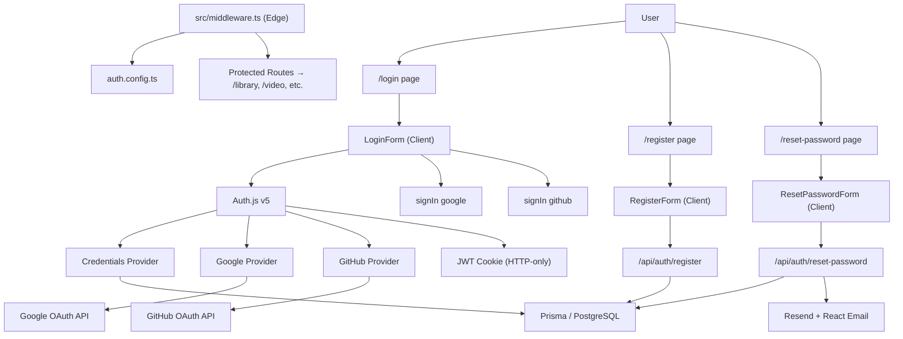

# Spec: F01 — Authentication System

## 1. Technical Overview

The Authentication System is VideoMax's foundational infrastructure layer. It implements email/password and OAuth social login (Google, GitHub) via Auth.js v5 with a Prisma adapter over PostgreSQL. Sessions are stateless JWT tokens stored in HTTP-only cookies, renewed on each authenticated request, with a 7-day maximum age. A custom credentials provider adds database-backed login lockout (5 consecutive failures → 15-minute block stored on the `users` row), and a password reset flow uses Resend for email delivery.

Because F01 also bootstraps the entire application — framework scaffolding, database initialization, ORM configuration, global layout, and route protection middleware — it must be implemented before any other feature. All subsequent features inherit the Prisma client, the Auth.js session, the middleware pattern, and the Next.js App Router conventions established here.

Auth.js v5 requires a split configuration: an edge-compatible `auth.config.ts` (no Node.js APIs) used by the middleware, and a full `auth.ts` (Node.js, bcrypt, Prisma adapter) used by the API route and server-side helpers. This split keeps route protection on the Edge runtime while sign-in logic runs on Node.js.

**Scope:**

Included:
- Next.js 15 project scaffolding, global layout, and font setup
- Prisma initialization with PostgreSQL and `users`, `accounts`, `password_reset_tokens` schema
- Auth.js v5 credentials provider with lockout enforcement
- Google OAuth 2.0 and GitHub OAuth 2.0 via Auth.js providers
- JWT session management (7-day expiry, HTTP-only cookie, auto-renewal)
- Route protection middleware (all paths except `/login`, `/register`, `/reset-password/**`)
- Registration API endpoint (email/password)
- Password reset request and confirm API endpoints
- React Email template + Resend integration for reset emails
- All auth UI pages and form components

Excluded:
- Email verification after registration
- Two-factor authentication (2FA)
- Server-side session revocation (logout clears cookie client-side; JWT remains valid until expiry)
- Admin user management

---

## 2. Architecture Impact

**Frontend:**

| File Path | New/Modified | Purpose | Key Responsibilities |
|-----------|--------------|---------|---------------------|
| `src/app/layout.tsx` | New | Root layout | HTML shell, SessionProvider wrapper, global styles, font variables |
| `src/app/(auth)/login/page.tsx` | New | Login page (RSC) | Redirect authenticated users to `/library`; render LoginForm |
| `src/app/(auth)/register/page.tsx` | New | Registration page (RSC) | Redirect authenticated users to `/library`; render RegisterForm |
| `src/app/(auth)/reset-password/page.tsx` | New | Reset request page (RSC) | Render ResetPasswordForm |
| `src/app/(auth)/reset-password/[token]/page.tsx` | New | New password page (RSC) | Render NewPasswordForm with token from URL params |
| `src/components/auth/login-form.tsx` | New | Login form (Client Component) | Email/password fields, social login buttons, lockout/error display, react-hook-form + Zod |
| `src/components/auth/register-form.tsx` | New | Register form (Client Component) | Name/email/password fields, inline validation, POST to `/api/auth/register` |
| `src/components/auth/reset-password-form.tsx` | New | Reset request form (Client Component) | Email field, POST to `/api/auth/reset-password`, always-success message display |
| `src/components/auth/new-password-form.tsx` | New | New password form (Client Component) | Password + confirm fields, POST to `/api/auth/reset-password/confirm` |

**Backend:**

| File Path | New/Modified | Purpose | Key Responsibilities |
|-----------|--------------|---------|---------------------|
| `src/app/api/auth/[...nextauth]/route.ts` | New | Auth.js catch-all handler | Export GET and POST from `auth.ts`; handles OAuth callbacks, session, sign-out |
| `src/app/api/auth/register/route.ts` | New | Registration API | Zod validation, duplicate email check, bcrypt hash, insert `users` row |
| `src/app/api/auth/reset-password/route.ts` | New | Reset request API | Zod validation, delete old tokens, generate + hash token, persist, send Resend email |
| `src/app/api/auth/reset-password/confirm/route.ts` | New | Reset confirm API | Zod validation, token hash lookup, expiry check, update password, delete token |
| `src/lib/auth.ts` | New | Auth.js v5 full config (Node.js) | Prisma adapter, credentials provider with lockout, Google/GitHub providers, JWT callbacks |
| `src/lib/auth.config.ts` | New | Auth.js edge-compatible config | `pages` config, `authorized` callback; used by middleware (no bcrypt or Prisma) |
| `src/middleware.ts` | New | Route protection middleware | Runs on Edge; protects all routes except auth pages; redirects to `/login` |
| `src/lib/db.ts` | New | Prisma client singleton | Cached `PrismaClient` instance; avoids connection pool exhaustion during hot-reload |
| `src/lib/email.ts` | New | Email utility | Resend client instance, `sendPasswordResetEmail(to, name, resetUrl)` function |
| `src/lib/validations/auth.ts` | New | Zod schemas | `loginSchema`, `registerSchema`, `resetPasswordSchema`, `newPasswordSchema` |
| `src/emails/password-reset.tsx` | New | React Email template | Reset email HTML with link, user name, and 1-hour expiry notice |

**Database:**

| Migration File | Tables Affected | Operation | Notes |
|----------------|-----------------|-----------|-------|
| `prisma/migrations/<timestamp>_initial_auth/migration.sql` | `users`, `accounts`, `password_reset_tokens` | CREATE | Auth.js v5 required schema + custom lockout and reset columns |



---

## 3. Technical Decisions

| Decision | Chosen Approach | Alternative Considered | Trade-off |
|----------|----------------|----------------------|-----------|
| Auth library | Auth.js v5 with Prisma adapter | Lucia Auth, Passport.js | Auth.js has less flexibility for custom flows but eliminates OAuth plumbing; Lucia gives full control at the cost of more code |
| Session strategy | JWT in HTTP-only cookie (stateless) | Database-backed sessions table | No session table required; tokens cannot be revoked server-side until 7-day expiry — acceptable for personal use |
| Lockout storage | `failed_login_attempts` + `locked_until` columns on `users` | Separate `login_attempts` table or Redis | Simpler schema, one fewer table; trade-off is an extra write to `users` on every login attempt |
| Reset token storage | SHA-256 hash of plain token in `password_reset_tokens` | Plain token in DB / signed JWT | Hashing prevents DB compromise from producing usable tokens; trade-off is an extra hash operation on confirm |
| Middleware config split | `auth.config.ts` (edge, no Node APIs) + `auth.ts` (Node, full) | Single `auth.ts` everywhere | Edge runtime cannot import bcrypt or Prisma directly; the split is mandated by Next.js Edge constraints |
| Email provider | Resend + React Email | Nodemailer + SMTP / MailHog locally | Resend has a generous free tier, a simple API, and a dev/test mode; trade-off is an external SaaS dependency |

---

## 4. Component Overview

See Architecture Impact section (Section 2) for the complete file list. Key internal contracts:

- `src/lib/db.ts` exports a single `prisma` singleton used by all API routes and the Auth.js adapter.
- `src/lib/auth.ts` exports `{ auth, signIn, signOut, handlers }`. `handlers` is re-exported from the `[...nextauth]` route.
- `src/lib/auth.config.ts` exports `authConfig` consumed by `src/middleware.ts`.
- `src/lib/validations/auth.ts` exports typed Zod schemas (`RegisterSchema`, `LoginSchema`, `ResetPasswordSchema`, `NewPasswordSchema`) used isomorphically by both forms and API routes.
- `src/lib/email.ts` exports `sendPasswordResetEmail(to: string, name: string, resetUrl: string): Promise<void>`.

---

## 5. API Contracts

### POST `/api/auth/register`
- **Authentication:** None (public endpoint)

**Request:**

| Field | Type | Required | Validation | Description |
|-------|------|----------|------------|-------------|
| `name` | `string` | Yes | 2–100 characters | Display name |
| `email` | `string` | Yes | Valid email format | Login email address |
| `password` | `string` | Yes | Min 8 chars, at least 1 digit | Account password |

**Request Example:**
```json
{
  "name": "Maria Silva",
  "email": "maria@example.com",
  "password": "securePass1"
}
```

**Response (201 — Created):**

| Field | Type | Description |
|-------|------|-------------|
| `success` | `boolean` | Always `true` |
| `message` | `string` | Human-readable confirmation |

```json
{
  "success": true,
  "message": "Account created. You can now log in."
}
```

**Error Codes:**

| Code | HTTP Status | Description |
|------|-------------|-------------|
| `AUTH001` | 400 | Validation error — one or more fields invalid |
| `AUTH002` | 409 | Email already registered |

---

### POST `/api/auth/reset-password`
- **Authentication:** None (public endpoint)

**Request:**

| Field | Type | Required | Validation | Description |
|-------|------|----------|------------|-------------|
| `email` | `string` | Yes | Valid email format | Email address for reset link |

**Request Example:**
```json
{
  "email": "maria@example.com"
}
```

**Response (200 — always, regardless of email existence):**

| Field | Type | Description |
|-------|------|-------------|
| `success` | `boolean` | Always `true` |
| `message` | `string` | Identical message whether email is found or not |

```json
{
  "success": true,
  "message": "If that email is registered, a reset link has been sent."
}
```

**Error Codes:**

| Code | HTTP Status | Description |
|------|-------------|-------------|
| `AUTH003` | 400 | Invalid email format |

---

### POST `/api/auth/reset-password/confirm`
- **Authentication:** None (token-based via URL param)

**Request:**

| Field | Type | Required | Validation | Description |
|-------|------|----------|------------|-------------|
| `token` | `string` | Yes | Non-empty string | Plain token from reset email link |
| `password` | `string` | Yes | Min 8 chars, at least 1 digit | New password |

**Request Example:**
```json
{
  "token": "a3f9b2c1d4e5f6a7b8c9d0e1f2a3b4c5d6e7f8a9b0c1d2e3f4a5b6c7d8e9f0",
  "password": "newSecurePass2"
}
```

**Response (200 — Success):**

| Field | Type | Description |
|-------|------|-------------|
| `success` | `boolean` | Always `true` |
| `message` | `string` | Confirmation message |

```json
{
  "success": true,
  "message": "Password updated successfully. You can now log in."
}
```

**Error Codes:**

| Code | HTTP Status | Description |
|------|-------------|-------------|
| `AUTH004` | 400 | Token not found (invalid or already used) |
| `AUTH005` | 400 | Token expired (`expires_at` is in the past) |
| `AUTH006` | 400 | New password validation failed |

---

## 6. Data Model

### Table: `users`

| Column | Type | Nullable | Default | Description |
|--------|------|----------|---------|-------------|
| `id` | `uuid` | No | `gen_random_uuid()` | Primary key |
| `name` | `varchar(255)` | No | — | Display name |
| `email` | `varchar(255)` | No | — | Unique login email |
| `email_verified` | `timestamptz` | Yes | `null` | Reserved for future email verification |
| `image` | `varchar(500)` | Yes | `null` | Avatar URL populated by OAuth providers |
| `password_hash` | `varchar(255)` | Yes | `null` | bcrypt hash; `null` for OAuth-only users |
| `failed_login_attempts` | `integer` | No | `0` | Consecutive failures since last successful login or reset |
| `locked_until` | `timestamptz` | Yes | `null` | Lockout expiry timestamp; `null` when not locked |
| `created_at` | `timestamptz` | No | `now()` | Record creation time |
| `updated_at` | `timestamptz` | No | `now()` | Last update time |

**Indexes:**

| Index Name | Columns | Type | Purpose |
|------------|---------|------|---------|
| `pk_users` | `id` | PRIMARY KEY | Row identity |
| `uq_users_email` | `email` | UNIQUE | Prevent duplicate registrations; email login lookup |

---

### Table: `accounts` (Auth.js v5 — OAuth provider linking)

| Column | Type | Nullable | Default | Description |
|--------|------|----------|---------|-------------|
| `id` | `uuid` | No | `gen_random_uuid()` | Primary key |
| `user_id` | `uuid` | No | — | FK → `users.id` ON DELETE CASCADE |
| `type` | `varchar(50)` | No | — | Provider type: `oauth` |
| `provider` | `varchar(50)` | No | — | `google` or `github` |
| `provider_account_id` | `varchar(255)` | No | — | Provider's user ID |
| `access_token` | `text` | Yes | `null` | OAuth access token |
| `refresh_token` | `text` | Yes | `null` | OAuth refresh token |
| `expires_at` | `integer` | Yes | `null` | Access token expiry (Unix epoch seconds) |
| `token_type` | `varchar(50)` | Yes | `null` | Typically `bearer` |
| `scope` | `varchar(500)` | Yes | `null` | OAuth scopes granted |
| `id_token` | `text` | Yes | `null` | OIDC id_token |
| `session_state` | `varchar(500)` | Yes | `null` | Provider session state |
| `created_at` | `timestamptz` | No | `now()` | — |
| `updated_at` | `timestamptz` | No | `now()` | — |

**Indexes:**

| Index Name | Columns | Type | Purpose |
|------------|---------|------|---------|
| `pk_accounts` | `id` | PRIMARY KEY | Row identity |
| `uq_accounts_provider` | `(provider, provider_account_id)` | UNIQUE | Prevent duplicate OAuth links |
| `ix_accounts_user_id` | `user_id` | btree | Lookup all accounts for a user |

**Constraints:**

| Constraint | Type | Definition | Purpose |
|------------|------|------------|---------|
| `fk_accounts_user_id` | FOREIGN KEY | `user_id REFERENCES users(id) ON DELETE CASCADE` | Auto-delete accounts when user is deleted |

---

### Table: `password_reset_tokens`

| Column | Type | Nullable | Default | Description |
|--------|------|----------|---------|-------------|
| `id` | `uuid` | No | `gen_random_uuid()` | Primary key |
| `email` | `varchar(255)` | No | — | Target email (not FK — allows lookup even if user email changes) |
| `token_hash` | `varchar(255)` | No | — | SHA-256 hex of the plain token sent in the email |
| `expires_at` | `timestamptz` | No | — | Set to `now() + interval '1 hour'` on insert |
| `created_at` | `timestamptz` | No | `now()` | — |

**Indexes:**

| Index Name | Columns | Type | Purpose |
|------------|---------|------|---------|
| `pk_password_reset_tokens` | `id` | PRIMARY KEY | Row identity |
| `uq_prt_token_hash` | `token_hash` | UNIQUE | Fast lookup on confirm; enforces one-use semantics |
| `ix_prt_email` | `email` | btree | Delete old tokens by email before inserting new one |

**Migration:**
```sql
CREATE EXTENSION IF NOT EXISTS "pgcrypto";

CREATE TABLE users (
    id UUID PRIMARY KEY DEFAULT gen_random_uuid(),
    name VARCHAR(255) NOT NULL,
    email VARCHAR(255) NOT NULL,
    email_verified TIMESTAMPTZ,
    image VARCHAR(500),
    password_hash VARCHAR(255),
    failed_login_attempts INTEGER NOT NULL DEFAULT 0,
    locked_until TIMESTAMPTZ,
    created_at TIMESTAMPTZ NOT NULL DEFAULT NOW(),
    updated_at TIMESTAMPTZ NOT NULL DEFAULT NOW()
);

CREATE UNIQUE INDEX uq_users_email ON users(email);

CREATE TABLE accounts (
    id UUID PRIMARY KEY DEFAULT gen_random_uuid(),
    user_id UUID NOT NULL REFERENCES users(id) ON DELETE CASCADE,
    type VARCHAR(50) NOT NULL,
    provider VARCHAR(50) NOT NULL,
    provider_account_id VARCHAR(255) NOT NULL,
    access_token TEXT,
    refresh_token TEXT,
    expires_at INTEGER,
    token_type VARCHAR(50),
    scope VARCHAR(500),
    id_token TEXT,
    session_state VARCHAR(500),
    created_at TIMESTAMPTZ NOT NULL DEFAULT NOW(),
    updated_at TIMESTAMPTZ NOT NULL DEFAULT NOW()
);

CREATE UNIQUE INDEX uq_accounts_provider ON accounts(provider, provider_account_id);
CREATE INDEX ix_accounts_user_id ON accounts(user_id);

CREATE TABLE password_reset_tokens (
    id UUID PRIMARY KEY DEFAULT gen_random_uuid(),
    email VARCHAR(255) NOT NULL,
    token_hash VARCHAR(255) NOT NULL,
    expires_at TIMESTAMPTZ NOT NULL,
    created_at TIMESTAMPTZ NOT NULL DEFAULT NOW()
);

CREATE UNIQUE INDEX uq_prt_token_hash ON password_reset_tokens(token_hash);
CREATE INDEX ix_prt_email ON password_reset_tokens(email);
```

---

## 7. Testing Strategy

**Test file structure:**

| Test File | Test Type | Target | Coverage Goal |
|-----------|-----------|--------|---------------|
| `tests/unit/auth/validation.test.ts` | Unit | `src/lib/validations/auth.ts` | 100% schema branches |
| `tests/unit/auth/password.test.ts` | Unit | bcrypt and SHA-256 utilities | 90% |
| `tests/integration/auth/register.test.ts` | Integration (real DB) | `/api/auth/register` | 85% |
| `tests/integration/auth/login.test.ts` | Integration (real DB) | Credentials provider, lockout | 85% |
| `tests/integration/auth/reset-password.test.ts` | Integration (real DB) | Reset request + confirm endpoints | 85% |
| `tests/e2e/auth/login.spec.ts` | E2E (Playwright) | Login page flow | PRD acceptance criteria |
| `tests/e2e/auth/register.spec.ts` | E2E (Playwright) | Registration page flow | PRD acceptance criteria |
| `tests/e2e/auth/reset-password.spec.ts` | E2E (Playwright) | Password reset flow | PRD acceptance criteria |

Note: integration tests use a dedicated test PostgreSQL database (real DB, no mocks) to prevent divergence between test and production behavior.

---

**`tests/unit/auth/validation.test.ts`:**

| Test Function | Description | Assertions |
|---------------|-------------|------------|
| `test_register_schema_valid` | Valid name/email/password passes | Parses without error, types correct |
| `test_register_password_too_short` | Password under 8 chars fails | ZodError on `password` field |
| `test_register_password_no_digit` | Password without a digit fails | ZodError on `password` field |
| `test_register_invalid_email` | Malformed email fails | ZodError on `email` field |
| `test_register_name_too_short` | Name under 2 chars fails | ZodError on `name` field |
| `test_login_schema_valid` | Valid email/password passes | Parses without error |
| `test_reset_schema_valid_email` | Valid email passes | Parses without error |
| `test_reset_schema_invalid_email` | Malformed email fails | ZodError on `email` field |
| `test_new_password_schema_valid` | Matching passwords pass | Parses without error |
| `test_new_password_schema_mismatch` | Password/confirm mismatch fails | ZodError on `confirmPassword` |

---

**`tests/integration/auth/register.test.ts`:**

| Test Function | Description | Assertions |
|---------------|-------------|------------|
| `test_register_success` | Valid new user | Returns 201, `users` row exists in DB, `password_hash` set, plain password not stored |
| `test_register_duplicate_email` | Email already in `users` | Returns 409, code `AUTH002` |
| `test_register_short_password` | Password < 8 chars | Returns 400, code `AUTH001` |
| `test_register_invalid_email_format` | Malformed email | Returns 400, code `AUTH001` |
| `test_register_name_missing` | No `name` field | Returns 400, code `AUTH001` |

---

**`tests/integration/auth/login.test.ts`:**

| Test Function | Description | Assertions |
|---------------|-------------|------------|
| `test_login_correct_credentials` | Valid email + matching password | Auth.js session cookie set, redirect to `/library` |
| `test_login_wrong_password` | Correct email, wrong password | Error message equals "Email or password is incorrect.", `failed_login_attempts` incremented by 1 |
| `test_login_unknown_email` | Email not in DB | Same error message as wrong password (no enumeration) |
| `test_login_lockout_on_fifth_failure` | 5 consecutive failures | On 5th attempt `locked_until` is set ~15 min in future |
| `test_login_blocked_while_locked` | Attempt while `locked_until > now()` | Returns lockout message "Too many attempts. Try again in 15 minutes." |
| `test_login_resets_counter_on_success` | Successful login after prior failures | `failed_login_attempts = 0`, `locked_until = null` |

---

**`tests/integration/auth/reset-password.test.ts`:**

| Test Function | Description | Assertions |
|---------------|-------------|------------|
| `test_reset_request_known_email` | Registered email → request | Returns 200, `password_reset_tokens` row created (hashed), Resend called once |
| `test_reset_request_unknown_email` | Unregistered email → request | Returns 200 with identical message, no token row, Resend not called |
| `test_reset_request_replaces_old_token` | Second request for same email | Old token row deleted, new one created |
| `test_reset_confirm_valid_token` | Valid token, valid new password | Returns 200, `password_hash` updated on `users`, token row deleted |
| `test_reset_confirm_expired_token` | Token `expires_at` in the past | Returns 400, code `AUTH005` |
| `test_reset_confirm_invalid_token` | Random/forged token string | Returns 400, code `AUTH004` |
| `test_reset_confirm_weak_password` | Valid token, password without digit | Returns 400, code `AUTH006` |

---

**`tests/e2e/auth/login.spec.ts`:**

| Test Function | Description | Assertions |
|---------------|-------------|------------|
| `test_email_login_success` | Valid credentials submitted | Redirected to `/library`, authenticated state confirmed |
| `test_email_login_wrong_password` | Wrong password submitted | "Email or password is incorrect." toast/error visible, remains on `/login` |
| `test_lockout_message_shown` | 5 failed attempts | "Too many attempts. Try again in 15 minutes." visible |
| `test_social_buttons_present` | Login page rendered | "Continue with Google" and "Continue with GitHub" buttons in DOM |
| `test_protected_route_redirect` | Unauthenticated GET `/library` | Browser redirected to `/login` |
| `test_logout_clears_session` | Authenticated user signs out | Session cookie removed, subsequent `/library` access redirects to `/login` |

---

**`tests/e2e/auth/register.spec.ts`:**

| Test Function | Description | Assertions |
|---------------|-------------|------------|
| `test_registration_success` | Valid form submitted | Redirected to `/login` with success confirmation |
| `test_registration_duplicate_email` | Already-registered email | Error "An account with this email already exists. Log in instead." visible |
| `test_registration_inline_validation` | Short password typed | Inline error visible before form submission |

---

**`tests/e2e/auth/reset-password.spec.ts`:**

| Test Function | Description | Assertions |
|---------------|-------------|------------|
| `test_reset_request_shows_confirmation` | Email submitted on reset page | Confirmation message visible regardless of email existence |
| `test_reset_confirm_success` | Valid token URL visited, new password set | Redirected to `/login` with success confirmation |
| `test_reset_confirm_expired_link` | Expired token URL visited | "This link has expired. Request a new password reset." error visible |
