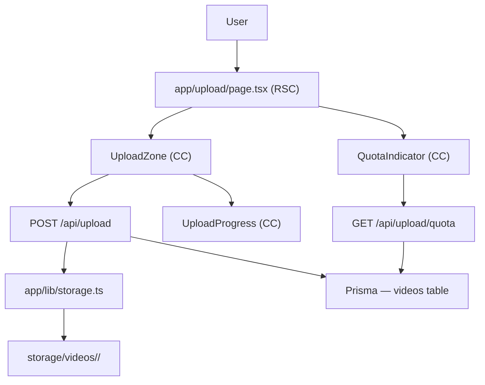

# F02. Video Upload — Technical Specification

## 1. Technical Overview

F02 adds a dedicated `/upload` route where authenticated users can upload video files via drag-and-drop or file picker. The upload is transmitted as a single `multipart/form-data` POST using `XMLHttpRequest`, which exposes native `upload.onprogress` events to drive a real-time progress display: filename, percentage, current speed in KB/s or MB/s, and estimated time remaining. Files are received on the server via `request.formData()` and written to the local filesystem under `storage/videos/<userId>/` using a UUID-based filename to prevent collisions.

The server enforces two constraints synchronously before writing: the `Content-Type` must begin with `video/` and the file must not exceed 300 MB. A quota check (SUM of all `fileSizeBytes` for the user) gates uploads that would exceed the 1 GB per-user limit. On abort (user clicks Cancel), `xhr.abort()` closes the connection and the server's `request.signal` fires, triggering deletion of any partial file before the response closes. On successful completion, a `Video` record is inserted with status `Queued` and the response body is returned to the client.

**Scope — Included:**
- `/upload` page with drag-and-drop zone and file picker button
- Client-side validation (MIME type, file size) before XHR transmission begins
- XHR upload with real-time progress: filename, percentage bar, speed, ETA
- Cancel button: aborts XHR; server deletes partial file via `request.signal`
- Quota indicator rendered before file selection: "X MB used of 1 GB"
- `POST /api/upload` — stream file to local disk, create Video record with status Queued
- `GET /api/upload/quota` — aggregated usage for authenticated user
- `Video` Prisma model with all columns needed through F06 (except category/tag/transcription relations)
- Toast notification: "Upload complete. Processing started." after successful upload

**Scope — Deferred (handled by later features):**
- Thumbnail generation and display (F03)
- Transcription processing (F03)
- Category and tag assignment (F05)
- Library card rendering for the Queued video (F04)
- Floating upload button on `/library` (F04)

---

## 2. Architecture Impact

**Affected components:**

| Layer | Component | Change |
|-------|-----------|--------|
| Page | `app/upload/page.tsx` | New RSC |
| Component | `app/components/upload/upload-zone.tsx` | New CC |
| Component | `app/components/upload/upload-progress.tsx` | New CC |
| Component | `app/components/upload/quota-indicator.tsx` | New CC |
| API | `app/api/upload/route.ts` | New route handler |
| API | `app/api/upload/quota/route.ts` | New route handler |
| Library | `app/lib/storage.ts` | New utility |
| Library | `app/lib/validations/upload.ts` | New Zod schemas |
| Schema | `prisma/schema.prisma` | Add Video model + VideoStatus enum |
| Route protection | `proxy.ts` | No change — catch-all matcher already covers `/upload` |



---

## 3. Technical Decisions

| Decision | Chosen Approach | Alternative Considered | Trade-off |
|----------|----------------|----------------------|-----------|
| Upload mechanism | XHR with `upload.onprogress` | `fetch` + `ReadableStream` TransformStream | XHR exposes `loaded`, `total`, and elapsed time natively via `ProgressEvent`; fetch progress requires a custom `TransformStream` wrapper with no built-in ETA calculation |
| File storage | Local filesystem `storage/videos/<userId>/` | Cloud object storage (S3/R2) | Eliminates external service dependency for a personal local-first platform; `storage.ts` abstraction layer makes future migration straightforward |
| Quota tracking | `SUM(fileSizeBytes)` aggregation at request time | Cached `quotaUsedBytes` counter on User | Always accurate without cache invalidation complexity; acceptable for a single-user platform with ≤ 1,000 videos |
| Cancel cleanup | `request.signal` abort handler in route handler | Separate `DELETE /api/upload/:uploadId` endpoint | Single request handles both transfer and cleanup; no partial-file ID needs to reach the client, no extra network round trip on cancel |

---

## 4. Component Overview

**Frontend:**

| File Path | New/Modified | Purpose | Key Responsibilities |
|-----------|--------------|---------|---------------------|
| `app/upload/page.tsx` | New | Upload page RSC | Render UploadZone and QuotaIndicator; redirect unauthenticated users (handled by proxy) |
| `app/components/upload/upload-zone.tsx` | New | Drop zone + file picker CC | Handle `dragover`/`drop` events, file input `change`, client-side MIME + size validation, XHR lifecycle, expose progress state to UploadProgress, cancel on button click |
| `app/components/upload/upload-progress.tsx` | New | Progress display CC | Receive `progressEvent` props; render filename, percentage bar, speed (KB/s or MB/s), ETA string |
| `app/components/upload/quota-indicator.tsx` | New | Quota display CC | Fetch GET /api/upload/quota on mount; render "X MB used of 1 GB"; re-fetch after upload completes |

**Backend:**

| File Path | New/Modified | Purpose | Key Responsibilities |
|-----------|--------------|---------|---------------------|
| `app/api/upload/route.ts` | New | File upload handler | Authenticate session, validate MIME + size, check quota, write file via `storage.ts`, create Video record, listen to `request.signal` for cleanup on abort |
| `app/api/upload/quota/route.ts` | New | Quota query handler | Authenticate session, aggregate `_sum { fileSizeBytes }` via Prisma, return JSON |
| `app/lib/storage.ts` | New | Filesystem utility | `saveFile(userId, ext, buffer)` → writes to `storage/videos/<userId>/<uuid>.<ext>`, returns relative path; `deleteFile(filePath)` → unlinks (idempotent) |
| `app/lib/validations/upload.ts` | New | Upload Zod schemas | `MAX_FILE_BYTES` constant (314_572_800); `QUOTA_BYTES` constant (1_073_741_824); helper `isVideoMime(mime: string)` |

**Database:**

| Migration | Tables Affected | Operation | Notes |
|-----------|-----------------|-----------|-------|
| Prisma migration | `videos` | CREATE | `VideoStatus` enum + Video model; run `npx prisma migrate dev --name add-video-model` |

---

## 5. API Contracts

### GET /api/upload/quota

- **Authentication:** Auth.js session cookie (required)

**Response (200):**

| Field | Type | Description |
|-------|------|-------------|
| `usedBytes` | `number` | Sum of `fileSizeBytes` for all non-deleted videos owned by the user |
| `totalBytes` | `number` | Hard quota limit: `1073741824` (1 GB) |
| `remainingBytes` | `number` | `totalBytes - usedBytes` |

**Response Example:**
```json
{
  "usedBytes": 524288000,
  "totalBytes": 1073741824,
  "remainingBytes": 549453824
}
```

**Error Codes:**

| Code | HTTP Status | Description |
|------|-------------|-------------|
| — | 401 | No valid session |

---

### POST /api/upload

- **Authentication:** Auth.js session cookie (required)
- **Content-Type:** `multipart/form-data`
- **Body field:** `file` — the video binary

**Request Example (sent by XHR):**
```
POST /api/upload
Content-Type: multipart/form-data; boundary=----FormBoundary

------FormBoundary
Content-Disposition: form-data; name="file"; filename="lecture-01.mp4"
Content-Type: video/mp4

<binary data>
------FormBoundary--
```

**Response (201):**

| Field | Type | Description |
|-------|------|-------------|
| `video.id` | `string` | UUID of the created Video record |
| `video.filePath` | `string` | Relative storage path from project root |
| `video.originalName` | `string` | Original filename supplied by the client |
| `video.mimeType` | `string` | MIME type from the file part (e.g. `video/mp4`) |
| `video.fileSizeBytes` | `number` | File size in bytes (serialized from BigInt; safe for ≤ 300 MB) |
| `video.status` | `string` | Always `"Queued"` |
| `video.uploadedAt` | `string` | ISO 8601 timestamp |

**Response Example:**
```json
{
  "video": {
    "id": "550e8400-e29b-41d4-a716-446655440000",
    "filePath": "storage/videos/user_abc123/a1b2c3d4-uuid.mp4",
    "originalName": "lecture-01.mp4",
    "mimeType": "video/mp4",
    "fileSizeBytes": 52428800,
    "status": "Queued",
    "uploadedAt": "2026-06-20T14:32:00.000Z"
  }
}
```

**Error Codes:**

| Code | HTTP Status | Description |
|------|-------------|-------------|
| UPLOAD001 | 400 | File size exceeds 300 MB limit |
| UPLOAD002 | 400 | MIME type does not begin with `video/` |
| UPLOAD003 | 400 | Upload would exceed the user's 1 GB quota |
| UPLOAD004 | 500 | Server error during file write or database insert |
| — | 401 | No valid session |

---

## 6. Data Model

**Table: `videos`** (Prisma model `Video`)

| Column | Type | Nullable | Default | Description |
|--------|------|----------|---------|-------------|
| `id` | `String (UUID)` | No | `uuid()` | Primary key |
| `userId` | `String` | No | — | FK to `users.id` |
| `title` | `String` | No | — | Display title; seeded from `originalName` at upload, updated by F05 |
| `description` | `String` | Yes | `null` | User-written notes; set by F05 |
| `originalName` | `String` | No | — | Original filename supplied by the browser (preserved for display) |
| `filePath` | `String` | No | — | Relative path from project root: `storage/videos/<userId>/<uuid>.<ext>` |
| `mimeType` | `String` | No | — | e.g. `video/mp4` |
| `fileSizeBytes` | `BigInt` | No | — | File size in bytes (`BigInt` because SUM over 1,000 videos can exceed Int32) |
| `status` | `VideoStatus` | No | `Queued` | Processing lifecycle state |
| `uploadedAt` | `DateTime` | No | `now()` | Timestamp when upload completed |
| `processingError` | `String` | Yes | `null` | Failure message set by F03 |
| `durationSeconds` | `Float` | Yes | `null` | Video duration set by F03 after processing |
| `thumbnailPath` | `String` | Yes | `null` | Relative thumbnail path set by F03 |
| `language` | `String` | Yes | `null` | ISO 639-1 code (pt/en/es) detected by F03 |
| `isArchived` | `Boolean` | No | `false` | Soft-delete flag toggled by F05 |
| `createdAt` | `DateTime` | No | `now()` | Record creation timestamp |
| `updatedAt` | `DateTime` | No | auto | Auto-updated on every write |

**Enum: `VideoStatus`**
```
Queued | Processing | Ready | Failed
```

**Indexes:**

| Index Name | Columns | Type | Purpose |
|------------|---------|------|---------|
| `idx_video_userId` | `userId` | btree | Scope all video queries to the authenticated user |
| `idx_video_userId_status` | `(userId, status)` | btree | Library filter by processing status (F04) |
| `idx_video_userId_uploadedAt` | `(userId, uploadedAt)` | btree | Default sort: newest upload first (F04) |

**Constraints:**

| Constraint | Type | Definition | Purpose |
|------------|------|------------|---------|
| `PK_video` | PRIMARY KEY | `id` | Unique identifier |
| `FK_video_user` | FOREIGN KEY | `userId REFERENCES users(id) ON DELETE CASCADE` | Remove all videos when a user account is deleted |

**Prisma schema additions to `prisma/schema.prisma`:**
```prisma
enum VideoStatus {
  Queued
  Processing
  Ready
  Failed
}

model Video {
  id               String      @id @default(uuid())
  userId           String
  title            String
  description      String?
  originalName     String
  filePath         String
  mimeType         String
  fileSizeBytes    BigInt
  status           VideoStatus @default(Queued)
  uploadedAt       DateTime    @default(now())
  processingError  String?
  durationSeconds  Float?
  thumbnailPath    String?
  language         String?
  isArchived       Boolean     @default(false)
  createdAt        DateTime    @default(now())
  updatedAt        DateTime    @updatedAt

  user             User        @relation(fields: [userId], references: [id], onDelete: Cascade)

  @@index([userId])
  @@index([userId, status])
  @@index([userId, uploadedAt])
  @@map("videos")
}
```

Add `videos Video[]` to the `User` model in `prisma/schema.prisma`.

**Migration command:**
```
npx prisma migrate dev --name add-video-model
```

---

## 7. Testing Strategy

**Test File Structure:**

| Test File | Type | Target | Coverage Goal |
|-----------|------|--------|---------------|
| `app/api/upload/__tests__/route.test.ts` | Integration | `POST /api/upload` | Happy path, all 4 error codes, abort cleanup |
| `app/api/upload/quota/__tests__/route.test.ts` | Integration | `GET /api/upload/quota` | With videos, empty user, unauthenticated |
| `app/lib/__tests__/storage.test.ts` | Unit | `app/lib/storage.ts` | saveFile, deleteFile, path construction, directory creation |
| `app/components/upload/__tests__/upload-zone.test.tsx` | Unit | `UploadZone` | Drop, pick, validation rejection, cancel, progress updates |

**`app/api/upload/__tests__/route.test.ts`:**

| Test Function | Description | Assertions |
|---------------|-------------|------------|
| `test_upload_success` | Valid `video/mp4` file under 300 MB, quota available | Returns 201; `video.status === "Queued"`; DB record exists; file present on disk |
| `test_upload_file_too_large` | File size = 314_572_801 bytes | Returns 400 with `{ code: "UPLOAD001" }` |
| `test_upload_invalid_mime` | `Content-Type: application/pdf` | Returns 400 with `{ code: "UPLOAD002" }` |
| `test_upload_quota_exceeded` | Existing videos sum to 1 GB | Returns 400 with `{ code: "UPLOAD003" }` and remaining bytes |
| `test_upload_abort_cleanup` | `request.signal` aborted mid-write | No DB record created; no partial file left on disk |
| `test_upload_unauthenticated` | No session cookie | Returns 401 |

**`app/api/upload/quota/__tests__/route.test.ts`:**

| Test Function | Description | Assertions |
|---------------|-------------|------------|
| `test_quota_with_videos` | User has 3 videos (100 MB, 200 MB, 50 MB) | `usedBytes === 367001600`; `remainingBytes === totalBytes - usedBytes` |
| `test_quota_empty_user` | User has no videos | `usedBytes === 0`; `remainingBytes === 1073741824` |
| `test_quota_unauthenticated` | No session | Returns 401 |

**`app/lib/__tests__/storage.test.ts`:**

| Test Function | Description | Assertions |
|---------------|-------------|------------|
| `test_saveFile_writes_to_disk` | Save Buffer to storage | File exists at returned path; content matches |
| `test_saveFile_creates_directory` | User directory does not exist yet | Directory created automatically; file written |
| `test_saveFile_returns_relative_path` | Check return value | Returned string starts with `storage/videos/` |
| `test_deleteFile_removes_file` | Delete an existing file | File no longer exists on disk |
| `test_deleteFile_missing_is_noop` | Delete non-existent path | Does not throw; function returns cleanly |

**`app/components/upload/__tests__/upload-zone.test.tsx`:**

| Test Function | Description | Assertions |
|---------------|-------------|------------|
| `test_drag_drop_valid_video` | Drop a `video/mp4` File object | XHR send called; `UploadProgress` rendered |
| `test_file_picker_valid_video` | Trigger `change` on hidden `<input>` | XHR send called; progress state updates |
| `test_reject_file_too_large` | Drop file with `size > 314572800` | "File too large. Maximum allowed size is 300 MB." shown; XHR not created |
| `test_reject_invalid_mime` | Drop `application/pdf` file | "Only video files are accepted." shown; XHR not created |
| `test_cancel_upload` | Click Cancel while XHR in progress | `xhr.abort()` called; progress UI cleared |
| `test_upload_complete_callback` | XHR `load` event fires with 201 | `onUploadComplete` callback invoked with video object |
