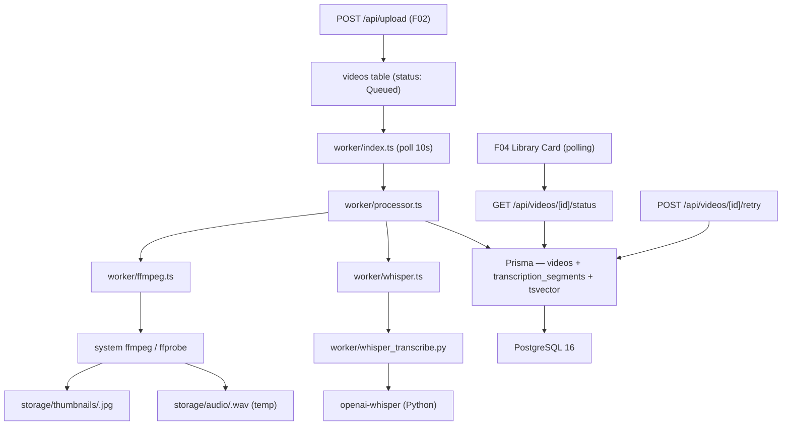

# Spec: F03 — Background Processing

## 1. Technical Overview

F03 Background Processing implements the automated pipeline that runs after every video upload. A standalone Node.js worker process polls the `videos` table every 10 seconds for rows in status `Queued`, selects the oldest job per user (FIFO via `uploadedAt ASC`), and processes them one at a time. Processing consists of four sequential steps: (1) metadata extraction and thumbnail generation via system FFmpeg/ffprobe, (2) audio extraction to a temporary WAV file via FFmpeg, (3) speech-to-text transcription and language detection via a local Python Whisper subprocess, and (4) persistence — writing `TranscriptionSegment` rows, updating the `Video` record with status, duration, thumbnail path, language, and a full-text search vector.

The worker runs as a separate process alongside `next dev`, sharing the same PostgreSQL database via the `app/lib/db.ts` Prisma singleton. On transient failure, the worker retries automatically up to 3 times by resetting the job to `Queued` and incrementing a `retryCount` column on the `Video` row. After 3 exhausted retries the status becomes `Failed` with a human-readable `processingError`. A `POST /api/videos/:id/retry` endpoint allows the user to manually re-queue a failed job (resets `retryCount` to 0). A `GET /api/videos/:id/status` endpoint exposes the full set of card fields so the library UI (F04) can poll every 10 seconds and reflect status transitions without a page reload.

Full-text transcription text is aggregated into a PostgreSQL `tsvector` column (`search_vector`) on the `videos` table after processing completes. This column is populated via `prisma.$executeRaw` in the worker and queried by F08 for global search. Because Prisma 7 does not natively support the `tsvector` type, the column and its GIN index are created via a raw SQL block included in the Prisma migration file; the Prisma schema references it as `Unsupported("tsvector")`.

**Scope — Included (Core + Full Scope):**
- Database polling worker (`worker/index.ts`) — FIFO ordering by `uploadedAt ASC`, one job at a time, 10 s polling interval
- FFmpeg integration via `child_process.spawn` — duration detection (`ffprobe`), thumbnail at 5 s mark (fallback: first frame), audio extraction to WAV (16 kHz mono)
- Python Whisper subprocess — timestamped transcription segments, auto language detection (pt / en / es, defaults to pt)
- `TranscriptionSegment` persistence (startMs, endMs, text) via Prisma
- Video status lifecycle updates: `Queued → Processing → Ready | Failed`
- Automatic retry ×3 tracked via `retryCount` column on `Video`; gate: `retryCount < 3` → back to Queued; `retryCount >= 3` → Failed
- Manual retry via `POST /api/videos/:id/retry` (resets `retryCount` to 0, status to Queued)
- `GET /api/videos/:id/status` — polling endpoint returning full card fields
- `search_vector tsvector` column on `videos` table, populated via raw SQL after transcription
- Temporary audio files written to `storage/audio/<videoId>.wav`, deleted after transcription completes
- Thumbnails written to `storage/thumbnails/<videoId>.jpg`, persisted

**Scope — Deferred:**
- Frontend polling hook and status badge UI (F04)
- Thumbnail serving HTTP endpoint: `GET /api/videos/:id/thumbnail` (F04)
- Transcription panel rendering and player integration (F06)
- Full-text search queries against `search_vector` (F08)
- `search_vector` updates when title/description change (F05/F08)
- WebSocket or SSE real-time updates (not required by PRD for this version)
- Parallel multi-video processing (worker is intentionally single-threaded)

---

## 2. Architecture Impact

**Worker Process:**

| File Path | New/Modified | Purpose | Key Responsibilities |
|-----------|--------------|---------|---------------------|
| `worker/index.ts` | New | Worker entry point + polling loop | `setInterval` 10 s; query one Queued video (`uploadedAt ASC`); call `processVideo()`; graceful shutdown on `SIGINT`/`SIGTERM` |
| `worker/processor.ts` | New | Job orchestrator | Set status to Processing → FFmpeg → Whisper → write segments → update tsvector → set Ready; retry gate on failure |
| `worker/ffmpeg.ts` | New | FFmpeg/ffprobe wrapper | `getDuration`, `generateThumbnail` (5 s with first-frame fallback), `extractAudio` (16 kHz mono WAV) |
| `worker/whisper.ts` | New | Whisper subprocess wrapper | Spawn Python script, parse JSON stdout, map to typed segments, normalize unsupported languages to `"pt"` |
| `worker/whisper_transcribe.py` | New | Python Whisper runner | Load model, transcribe audio file, print JSON `{language, segments}` to stdout; exit 1 on error |

**API Routes:**

| File Path | New/Modified | Purpose | Key Responsibilities |
|-----------|--------------|---------|---------------------|
| `app/api/videos/[id]/status/route.ts` | New | Status polling endpoint | `auth()` guard; `await params` (Next.js 16); Prisma lookup by id + userId; return card fields |
| `app/api/videos/[id]/retry/route.ts` | New | Manual retry endpoint | `auth()` guard; `await params`; verify ownership and `status === Failed`; reset to Queued |

**Database:**

| Migration | Tables Affected | Operation | Notes |
|-----------|-----------------|-----------|-------|
| Prisma migration `add-retry-and-segments` | `videos` | ALTER | Add `retry_count INTEGER NOT NULL DEFAULT 0` |
| Prisma migration (raw SQL block) | `videos` | ALTER | Add `search_vector tsvector` column + GIN index |
| Prisma migration `add-retry-and-segments` | `transcription_segments` | CREATE | New table for per-segment timestamped transcription |



---

## 3. Technical Decisions

| Decision | Chosen Approach | Alternative Considered | Trade-off |
|----------|----------------|----------------------|-----------|
| STT engine | Local Python Whisper subprocess (`openai-whisper`) | OpenAI Whisper API | No cloud dependency; fits the "easy local execution" design principle; requires Python + `openai-whisper` + (optionally) a GPU on the host; latency depends on hardware |
| FFmpeg invocation | `child_process.spawn` with system `ffmpeg`/`ffprobe` | `ffmpeg-static` npm package | Avoids npm SSL cert issue in this environment; assumes FFmpeg is globally installed; simpler setup for a local platform |
| Worker architecture | Separate Node.js process polling DB every 10 s | Fire-and-forget from upload handler | Durable across Next.js hot-reloads; natural FIFO ordering via `uploadedAt`; clean process boundary; requires running two processes in dev |
| Status polling | HTTP polling (setInterval 10 s) via dedicated route | Server-Sent Events / WebSocket | No extra infrastructure; matches the PRD's primary option; latency ≤ 10 s is acceptable for a personal platform |
| Full-text index | PostgreSQL `tsvector` on `videos.search_vector` | Separate `video_search_cache` table | Leverages existing PostgreSQL; zero new services; GIN index makes F08 queries fast; managed via raw SQL since Prisma 7 does not support `tsvector` natively |
| Retry counter | `retryCount` column on `videos` table | Separate `processing_jobs` audit table | Minimal schema impact; sufficient for max 3 retries; avoids an extra join in the worker polling query |

---

## 4. Component Overview

**Worker Process:**

| File Path | New/Modified | Purpose | Key Responsibilities |
|-----------|--------------|---------|---------------------|
| `worker/index.ts` | New | Entry point + polling loop | `setInterval` 10 s; Prisma query for one Queued video ordered by `uploadedAt ASC`; call `processVideo(id, filePath)`; register `SIGINT`/`SIGTERM` handlers to clear the interval and exit cleanly |
| `worker/processor.ts` | New | Job orchestrator | Export `processVideo(videoId, filePath)`: set status to Processing → call `getDuration`/`generateThumbnail`/`extractAudio` → call `transcribe` → delete temp audio → write `TranscriptionSegment` rows → update `search_vector` via `prisma.$executeRaw` → set status to Ready. On any thrown error: if `retryCount < 3` increment counter and reset to Queued; else set status to Failed with `processingError` |
| `worker/ffmpeg.ts` | New | FFmpeg/ffprobe wrapper | `getDuration(filePath): Promise<number>` — spawns `ffprobe -v quiet -print_format json -show_streams`; parses `streams[0].duration`. `generateThumbnail(filePath, videoId): Promise<string>` — spawns `ffmpeg -ss 5 -i <file> -vframes 1 <out>`, falls back to `-ss 0` on non-zero exit; creates `storage/thumbnails/` dir; returns relative path. `extractAudio(filePath, videoId): Promise<string>` — spawns `ffmpeg -i <file> -vn -ar 16000 -ac 1 -f wav <out.wav>`; creates `storage/audio/` dir; returns relative path |
| `worker/whisper.ts` | New | Whisper subprocess wrapper | `transcribe(audioPath): Promise<WhisperResult>` — spawns `python worker/whisper_transcribe.py <audioPath>`; collects stdout; parses JSON; maps to `{ language: string, segments: { startMs: number, endMs: number, text: string }[] }`; normalizes any language code outside `['pt','en','es']` to `'pt'`; rejects if exit code ≠ 0 |
| `worker/whisper_transcribe.py` | New | Python Whisper runner | `import whisper, json, sys`; load `whisper.load_model("base")`; call `model.transcribe(sys.argv[1])`; print `json.dumps({ "language": result["language"], "segments": [{"start": s["start"], "end": s["end"], "text": s["text"]} for s in result["segments"]] })`; exit 0 on success, exit 1 with `sys.stderr.write(str(e))` on exception |

**API Routes:**

| File Path | New/Modified | Purpose | Key Responsibilities |
|-----------|--------------|---------|---------------------|
| `app/api/videos/[id]/status/route.ts` | New | Status polling | `auth()` session guard; `const { id } = await params`; Prisma `findFirst` by `id + userId`; return 404 (PROC001) if not found; return 200 JSON with `id, status, processingError, thumbnailPath, durationSeconds, language, retryCount` |
| `app/api/videos/[id]/retry/route.ts` | New | Manual retry | `auth()` guard; `await params`; `findFirst` by `id + userId` (PROC001 if not found); reject 409 (PROC002) if `status !== 'Failed'`; `prisma.video.update({ status: Queued, retryCount: 0, processingError: null })`; return 200 |

**Database:**

| Migration File | Tables Affected | Operation | Notes |
|----------------|-----------------|-----------|-------|
| `prisma/migrations/<ts>_add-retry-and-segments/migration.sql` | `videos` | ALTER | Add `retry_count` via Prisma; add `search_vector tsvector` + GIN index via raw SQL block |
| `prisma/migrations/<ts>_add-retry-and-segments/migration.sql` | `transcription_segments` | CREATE | Via Prisma model |

---

## 5. API Contracts

### GET /api/videos/[id]/status

- **Authentication:** Auth.js session cookie (required)
- **URL param:** `id` — video UUID (resolved via `await params` — Next.js 16)

**Response (200):**

| Field | Type | Description |
|-------|------|-------------|
| `id` | `string` | Video UUID |
| `status` | `"Queued" \| "Processing" \| "Ready" \| "Failed"` | Current processing status |
| `processingError` | `string \| null` | Failure message set by worker; `null` when not failed |
| `thumbnailPath` | `string \| null` | Relative filesystem path (`storage/thumbnails/<id>.jpg`); `null` until processing completes |
| `durationSeconds` | `number \| null` | Duration in seconds; `null` until FFmpeg extraction completes |
| `language` | `string \| null` | ISO 639-1 code: `"pt"`, `"en"`, or `"es"`; `null` until transcription completes |
| `retryCount` | `number` | Number of automatic retry attempts consumed (0–3) |

**Response Example — Ready video:**
```json
{
  "id": "550e8400-e29b-41d4-a716-446655440000",
  "status": "Ready",
  "processingError": null,
  "thumbnailPath": "storage/thumbnails/550e8400-e29b-41d4-a716-446655440000.jpg",
  "durationSeconds": 342.5,
  "language": "pt",
  "retryCount": 0
}
```

**Response Example — Failed video:**
```json
{
  "id": "550e8400-e29b-41d4-a716-446655440000",
  "status": "Failed",
  "processingError": "Could not extract audio from this file.",
  "thumbnailPath": null,
  "durationSeconds": null,
  "language": null,
  "retryCount": 3
}
```

**Error Codes:**

| Code | HTTP Status | Description |
|------|-------------|-------------|
| — | 401 | No valid session |
| PROC001 | 404 | Video not found or does not belong to the authenticated user |

---

### POST /api/videos/[id]/retry

- **Authentication:** Auth.js session cookie (required)
- **URL param:** `id` — video UUID
- **Request body:** None

**Response (200):**

| Field | Type | Description |
|-------|------|-------------|
| `success` | `boolean` | Always `true` |
| `video.id` | `string` | Video UUID |
| `video.status` | `string` | Always `"Queued"` after reset |

**Response Example:**
```json
{
  "success": true,
  "video": {
    "id": "550e8400-e29b-41d4-a716-446655440000",
    "status": "Queued"
  }
}
```

**Error Codes:**

| Code | HTTP Status | Description |
|------|-------------|-------------|
| — | 401 | No valid session |
| PROC001 | 404 | Video not found or does not belong to the authenticated user |
| PROC002 | 409 | Video status is not `Failed` — retry is only available after failure |

---

## 6. Data Model

### Changes to existing `Video` model / `videos` table

Two columns are added:

| Column | Type | Nullable | Default | Description |
|--------|------|----------|---------|-------------|
| `retry_count` | `INTEGER` | No | `0` | Automatic retry counter; incremented by worker on each failed attempt; reset to 0 by `/retry` endpoint |
| `search_vector` | `tsvector` | Yes | `null` | Full-text search vector; populated by worker via raw SQL after transcription; queried by F08 |

**Prisma schema addition to the `Video` model:**
```prisma
model Video {
  // ... all existing fields ...
  retryCount            Int                     @default(0) @map("retry_count")
  searchVector          Unsupported("tsvector")? @map("search_vector")
  transcriptionSegments TranscriptionSegment[]
}
```

---

### New Table: `transcription_segments`

| Column | Type | Nullable | Default | Description |
|--------|------|----------|---------|-------------|
| `id` | `uuid` | No | `gen_random_uuid()` | Primary key |
| `video_id` | `uuid` | No | — | FK → `videos.id` ON DELETE CASCADE |
| `start_ms` | `integer` | No | — | Segment start position in milliseconds |
| `end_ms` | `integer` | No | — | Segment end position in milliseconds |
| `text` | `text` | No | — | Transcribed text for the segment |
| `created_at` | `timestamptz` | No | `now()` | — |

**Indexes:**

| Index Name | Columns | Type | Purpose |
|------------|---------|------|---------|
| `pk_transcription_segments` | `id` | PRIMARY KEY | Row identity |
| `ix_ts_video_id` | `video_id` | btree | Fast lookup of all segments for a video (used by F06 player) |

**Constraints:**

| Constraint | Type | Definition | Purpose |
|------------|------|------------|---------|
| `fk_ts_video_id` | FOREIGN KEY | `video_id REFERENCES videos(id) ON DELETE CASCADE` | Remove all segments when a video is deleted |

**Prisma model:**
```prisma
model TranscriptionSegment {
  id        String   @id @default(dbgenerated("gen_random_uuid()")) @db.Uuid
  videoId   String   @map("video_id") @db.Uuid
  startMs   Int      @map("start_ms")
  endMs     Int      @map("end_ms")
  text      String
  createdAt DateTime @default(now()) @map("created_at")

  video     Video    @relation(fields: [videoId], references: [id], onDelete: Cascade)

  @@index([videoId])
  @@map("transcription_segments")
}
```

---

### Migration SQL

The Prisma migration for `add-retry-and-segments` must include the following raw SQL alongside the generated Prisma DDL (added manually to the migration file after `npx prisma migrate dev --create-only`):

```sql
-- Add retry_count to videos (Prisma generates this)
ALTER TABLE videos ADD COLUMN IF NOT EXISTS retry_count INTEGER NOT NULL DEFAULT 0;

-- Add tsvector column (raw SQL — not generated by Prisma)
ALTER TABLE videos ADD COLUMN IF NOT EXISTS search_vector tsvector;
CREATE INDEX IF NOT EXISTS ix_videos_search_vector ON videos USING GIN(search_vector);

-- transcription_segments table (Prisma generates this)
CREATE TABLE transcription_segments (
    id UUID PRIMARY KEY DEFAULT gen_random_uuid(),
    video_id UUID NOT NULL REFERENCES videos(id) ON DELETE CASCADE,
    start_ms INTEGER NOT NULL,
    end_ms INTEGER NOT NULL,
    text TEXT NOT NULL,
    created_at TIMESTAMPTZ NOT NULL DEFAULT NOW()
);

CREATE INDEX ix_ts_video_id ON transcription_segments(video_id);
```

**Worker raw query to update `search_vector` after transcription:**

```sql
UPDATE videos
SET search_vector = to_tsvector(<pg_language_config>::regconfig, $1::text)
WHERE id = $2
```

Where `<pg_language_config>` maps from Whisper's detected language code: `'pt' → 'portuguese'`, `'en' → 'english'`, `'es' → 'spanish'`. The `$1` argument is the concatenation of all segment texts (space-separated).

---

## 7. Testing Strategy

**Test File Structure:**

| Test File | Test Type | Target | Coverage Goal |
|-----------|-----------|--------|---------------|
| `worker/__tests__/ffmpeg.test.ts` | Unit (mock `child_process.spawn`) | `worker/ffmpeg.ts` | Duration extraction, thumbnail (5 s + fallback), audio extraction, bad ffprobe output |
| `worker/__tests__/whisper.test.ts` | Unit (mock `child_process.spawn`) | `worker/whisper.ts` | Happy path, language normalization, exit code 1, malformed JSON |
| `worker/__tests__/processor.test.ts` | Unit (mock ffmpeg + whisper + Prisma) | `worker/processor.ts` | Full pipeline success, retry gate (attempts 1–3), retry exhausted at 3, temp file cleanup |
| `app/api/videos/[id]/status/__tests__/route.test.ts` | Integration (real DB) | `GET /api/videos/:id/status` | Ready, Queued, Failed states; wrong-user 404; unauthenticated 401 |
| `app/api/videos/[id]/retry/__tests__/route.test.ts` | Integration (real DB) | `POST /api/videos/:id/retry` | Failed → Queued reset; non-Failed 409; wrong-user 404; unauthenticated 401 |

---

**`worker/__tests__/ffmpeg.test.ts`:**

| Test Function | Description | Assertions |
|---------------|-------------|------------|
| `test_getDuration_returns_seconds` | Mock ffprobe stdout with valid JSON stream | Returns `342.5` as `number` |
| `test_getDuration_bad_output` | Mock ffprobe with no duration in stream | Rejects with descriptive error message |
| `test_generateThumbnail_at_5s` | Mock ffmpeg exits 0 on first attempt | Returns path `storage/thumbnails/<id>.jpg`; spawn called with `-ss 5` |
| `test_generateThumbnail_fallback_first_frame` | Mock ffmpeg exits non-0 at 5 s, exits 0 at 0 s | Returns path; second spawn called with `-ss 0` |
| `test_generateThumbnail_both_attempts_fail` | Both spawns exit non-0 | Rejects with error |
| `test_extractAudio_returns_wav_path` | Mock ffmpeg exits 0 | Returns `storage/audio/<id>.wav`; spawn called with `-ar 16000 -ac 1` |
| `test_extractAudio_ffmpeg_error` | Mock ffmpeg exits 1 with stderr | Rejects with "Could not extract audio from this file." |

---

**`worker/__tests__/whisper.test.ts`:**

| Test Function | Description | Assertions |
|---------------|-------------|------------|
| `test_transcribe_success_portuguese` | Mock Python exits 0; JSON stdout with `language: "pt"` | Returns `{ language: 'pt', segments: [...] }` with `startMs` / `endMs` in ms |
| `test_transcribe_success_english` | Mock Python exits 0; `language: "en"` | Returns `{ language: 'en', segments: [...] }` |
| `test_transcribe_unsupported_language_normalizes_to_pt` | Mock Python returns `language: "fr"` | Returns `{ language: 'pt', segments: [...] }` |
| `test_transcribe_python_exit_1` | Mock Python exits 1 with stderr message | Rejects; error message contains stderr content |
| `test_transcribe_malformed_json` | Mock Python exits 0; invalid JSON on stdout | Rejects with JSON parse error |
| `test_transcribe_segments_converted_to_ms` | `start: 1.5, end: 3.0` in Python output | `startMs: 1500, endMs: 3000` in result |

---

**`worker/__tests__/processor.test.ts`:**

| Test Function | Description | Assertions |
|---------------|-------------|------------|
| `test_process_video_success` | All steps succeed; retryCount 0 | Status set to Ready; TranscriptionSegment rows created; `$executeRaw` called with tsvector update |
| `test_process_video_sets_duration_and_thumbnail` | FFmpeg returns values | `durationSeconds` and `thumbnailPath` updated on Video row |
| `test_process_video_deletes_temp_audio_on_success` | WAV exists after transcription | `deleteFile(audioPath)` called before status set to Ready |
| `test_process_video_deletes_temp_audio_on_failure` | FFmpeg succeeds, Whisper throws; retryCount 0 | `deleteFile(audioPath)` still called; status reset to Queued; retryCount becomes 1 |
| `test_process_video_retry_gate_attempt_1` | Any step throws; retryCount 0 | `processingError` set; status reset to Queued; retryCount becomes 1 |
| `test_process_video_retry_gate_attempt_2` | Any step throws; retryCount 1 | Status reset to Queued; retryCount becomes 2 |
| `test_process_video_retry_gate_attempt_3` | Any step throws; retryCount 2 | Status reset to Queued; retryCount becomes 3 |
| `test_process_video_retry_exhausted` | Any step throws; retryCount 3 | Status set to Failed; retryCount stays 3; `processingError` non-null |

---

**`app/api/videos/[id]/status/__tests__/route.test.ts`:**

| Test Function | Description | Assertions |
|---------------|-------------|------------|
| `test_status_ready_video` | Video status Ready; all fields populated | Returns 200; `thumbnailPath`, `durationSeconds`, `language` non-null |
| `test_status_queued_video` | Video status Queued | Returns 200; `thumbnailPath`, `durationSeconds`, `language` all null |
| `test_status_failed_video` | Video status Failed; processingError set | Returns 200; `processingError` non-null; `retryCount` equals 3 |
| `test_status_wrong_user` | Video exists but belongs to a different user | Returns 404 with code `PROC001` |
| `test_status_video_not_found` | UUID does not exist | Returns 404 with code `PROC001` |
| `test_status_unauthenticated` | No session cookie | Returns 401 |

---

**`app/api/videos/[id]/retry/__tests__/route.test.ts`:**

| Test Function | Description | Assertions |
|---------------|-------------|------------|
| `test_retry_failed_video` | Video status is Failed | Returns 200; status becomes Queued; retryCount becomes 0; processingError becomes null |
| `test_retry_non_failed_video_ready` | Video status is Ready | Returns 409 with code `PROC002` |
| `test_retry_non_failed_video_queued` | Video status is Queued | Returns 409 with code `PROC002` |
| `test_retry_wrong_user` | Video belongs to different user | Returns 404 with code `PROC001` |
| `test_retry_unauthenticated` | No session cookie | Returns 401 |
