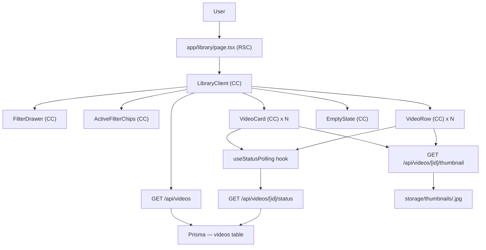

# Spec: F04 — Video Library

## 1. Technical Overview

F04 Video Library replaces the placeholder `/library` page with a full-featured video browsing experience. The page is an RSC shell that renders a Client Component toolbar and video grid/list; real data is fetched from a new `GET /api/videos` endpoint that returns paginated, filtered, and sorted video rows. A new `GET /api/videos/[id]/thumbnail` endpoint serves thumbnail images from the `storage/thumbnails/` directory, keeping binary file delivery out of the page rendering path.

The library supports two display modes (grid — 4 columns desktop / 2 mobile, and list), persistent URL-driven filter state (status, upload date range, showArchived, page), and a side-drawer filter panel. Active filters are reflected as removable chips below the toolbar. Cards and rows poll `GET /api/videos/[id]/status` every 10 seconds for any video in `Queued` or `Processing` state — using a React hook with `setInterval` — so status transitions surface without a page reload, completing the F03 cross-feature integration requirement.

Categories and tags are consumed by the library UI (chips on cards and rows) but their backing relational tables belong to F05. In F04 these arrays are returned as empty by the API and rendered as zero chips; the response shape already includes `categories` and `tags` fields so the UI components are forward-compatible with F05 without changes.

**Scope — Included:**
- Fully replace `app/library/page.tsx` with toolbar, view-mode toggle, filter drawer, active-filter chips, and video grid/list
- `GET /api/videos` — paginated video list with query-param filters: `status`, `uploadedAtFrom`, `uploadedAtTo`, `showArchived`, `page`; returns 20 items per page
- `GET /api/videos/[id]/thumbnail` — stream thumbnail file from `storage/thumbnails/`; return 404 if `thumbnailPath` is null or file is missing
- Two display mode components: `VideoCard` (grid) and `VideoRow` (list)
- `useStatusPolling` React hook — polls `GET /api/videos/[id]/status` every 10 s for in-flight videos; updates card state in-place
- Filter side drawer — opens via toolbar trigger; category multi-select, tag multi-select, status single-select, date range pickers, showArchived toggle
- Empty-state components for no-videos and no-results-match cases
- Zod validation for `GET /api/videos` query params

**Scope — Deferred:**
- Category and tag relational tables and population (F05)
- Video detail page `/video/:id` with player (F06)
- Global search bar in nav (F08)
- `search_vector` queries (F08)
- Categories/tags multi-select populated with real options (F05)

---

## 2. Architecture Impact

**Affected Components:**

| Layer | Component | Change |
|-------|-----------|--------|
| Page | `app/library/page.tsx` | Modified (full replacement) |
| Component | `app/components/library/library-client.tsx` | New CC — library shell |
| Component | `app/components/library/video-card.tsx` | New CC — grid card |
| Component | `app/components/library/video-row.tsx` | New CC — list row |
| Component | `app/components/library/filter-drawer.tsx` | New CC — side drawer |
| Component | `app/components/library/active-filter-chips.tsx` | New CC — chips bar |
| Component | `app/components/library/empty-state.tsx` | New CC — both empty states |
| Hook | `app/hooks/use-status-polling.ts` | New — 10 s polling hook |
| API | `app/api/videos/route.ts` | New route handler |
| API | `app/api/videos/[id]/thumbnail/route.ts` | New route handler |
| Lib | `app/lib/validations/library.ts` | New — Zod query-param schema |



---

## 3. Technical Decisions

| Decision | Chosen Approach | Alternative Considered | Trade-off |
|----------|----------------|----------------------|-----------|
| Filter state storage | URL search params (`useSearchParams` + `router.replace`) | React `useState` only | URL-driven state enables shareable/bookmarkable filtered views and survives browser refresh without extra persistence; slight complexity in param serialization |
| Status polling | Client-side `setInterval` 10 s via `useStatusPolling` hook, calling existing `GET /api/videos/[id]/status` | Server-Sent Events / WebSocket | Consistent with the decision made in F03 spec; no infrastructure overhead; ≤10 s latency acceptable for a personal platform |
| Thumbnail serving | Dedicated `GET /api/videos/[id]/thumbnail` route that streams the file | Serve static files from `/public/thumbnails/` | Keeps the storage directory outside the public web root (no direct URL access); enforces ownership check; consistent with how uploads are handled |
| Categories/Tags in F04 | Return empty arrays from `GET /api/videos`; UI renders 0 chips | Skip fields until F05 | Contracts established now; UI components are forward-compatible with F05 without modification; zero additional DB schema needed in F04 |
| Pagination strategy | Offset-based (`page` param, 20 per page, max 1 000 videos) | Cursor-based pagination | Simple to implement with Prisma `skip`/`take`; acceptable for ≤1 000 rows; cursor pagination deferred until scale requires it |

---

## 4. Component Overview

**Frontend:**

| File Path | New/Modified | Purpose | Key Responsibilities |
|-----------|--------------|---------|---------------------|
| `app/library/page.tsx` | Modified | Library RSC shell | Call `auth()` for session; fetch initial video page from `GET /api/videos`; pass data to `LibraryClient`; handle redirect when unauthenticated |
| `app/components/library/library-client.tsx` | New | Top-level CC orchestrator | Manage view-mode toggle state; read/write URL search params for filters and page; render toolbar, drawer, chips, grid/list, pagination, empty states |
| `app/components/library/video-card.tsx` | New | Grid card CC | Display thumbnail (`` src → thumbnail endpoint), title (2-line clamp), duration badge, up to 2 category chips, status badge; accept `video` prop; trigger `useStatusPolling` for in-flight statuses |
| `app/components/library/video-row.tsx` | New | List row CC | Display small thumbnail, title, duration, up to 3 categories, up to 3 tags, status badge, formatted `uploadedAt`; accept `video` prop; trigger `useStatusPolling` for in-flight statuses |
| `app/components/library/filter-drawer.tsx` | New | Side drawer CC | Open/close state; render status single-select, date range pickers, showArchived toggle; call parent `onApply` with new filter values; "Clear all" button resets all filter fields |
| `app/components/library/active-filter-chips.tsx` | New | Active filter chips bar CC | Read current URL params; render one removable chip per active filter; "Clear all" link that resets all params; individual chip × removes just that filter |
| `app/components/library/empty-state.tsx` | New | Empty state CC | Accept `variant: 'no-videos' | 'no-results'` prop; render appropriate message and CTA (`/upload` link or "Clear filters" link) |
| `app/hooks/use-status-polling.ts` | New | Status polling hook | Accept list of video IDs that are Queued or Processing; run `setInterval` 10 s; call `GET /api/videos/[id]/status` for each; merge updates into local state via callback; clear interval on unmount |

**Backend:**

| File Path | New/Modified | Purpose | Key Responsibilities |
|-----------|--------------|---------|---------------------|
| `app/api/videos/route.ts` | New | Video list endpoint | `auth()` guard; parse + validate query params via Zod (LIB001 on invalid); build Prisma `where` clause with `userId`, `isArchived`, `status`, `uploadedAt` range; return 20 videos per page ordered by `uploadedAt DESC` then `title ASC`; include `categories: []` and `tags: []` stubs |
| `app/api/videos/[id]/thumbnail/route.ts` | New | Thumbnail serving | `auth()` guard; `await params`; look up video by `id + userId` (LIB002 on not found); return 404 (LIB003) if `thumbnailPath` is null or file does not exist; stream file with `Content-Type: image/jpeg` |
| `app/lib/validations/library.ts` | New | Zod query-param schemas | `listVideosSchema`: validate `status` enum, `uploadedAtFrom`/`To` as ISO date strings, `page` as positive integer, `showArchived` as boolean string; coerce types from string query params |

---

## 5. API Contracts

### GET /api/videos

- **Method:** GET
- **Path:** `/api/videos`
- **Authentication:** Auth.js session cookie (required)

**Query Parameters:**

| Field | Type | Required | Validation | Description |
|-------|------|----------|------------|-------------|
| `status` | `string` | No | enum: `Queued`, `Processing`, `Ready`, `Failed` | Filter by processing status |
| `uploadedAtFrom` | `string` | No | ISO 8601 date string | Inclusive start of upload date range |
| `uploadedAtTo` | `string` | No | ISO 8601 date string | Inclusive end of upload date range (set to end of day) |
| `showArchived` | `string` | No | `"true"` or `"false"`; defaults to `"false"` | When `"true"`, include archived videos |
| `page` | `string` | No | Positive integer string; defaults to `"1"` | Page number (1-indexed) |

**Request Example:**
```
GET /api/videos?status=Ready&page=1&showArchived=false
```

**Response (200):**

| Field | Type | Description |
|-------|------|-------------|
| `videos` | `array` | Array of video objects (up to 20) |
| `videos[].id` | `string` | Video UUID |
| `videos[].title` | `string` | Video title |
| `videos[].originalName` | `string` | Original filename at upload |
| `videos[].status` | `string` | `Queued`, `Processing`, `Ready`, or `Failed` |
| `videos[].durationSeconds` | `number \| null` | Duration in seconds; null until processing completes |
| `videos[].thumbnailPath` | `string \| null` | Relative path; client uses thumbnail endpoint |
| `videos[].uploadedAt` | `string` | ISO 8601 datetime |
| `videos[].isArchived` | `boolean` | Whether the video is archived |
| `videos[].processingError` | `string \| null` | Failure reason; null when not failed |
| `videos[].fileSizeBytes` | `number` | File size as Number (serialized from BigInt) |
| `videos[].categories` | `array` | Always `[]` in F04; populated by F05 |
| `videos[].tags` | `array` | Always `[]` in F04; populated by F05 |
| `pagination.page` | `number` | Current page number |
| `pagination.pageSize` | `number` | Items per page (always 20) |
| `pagination.total` | `number` | Total matching videos count |
| `pagination.totalPages` | `number` | Total pages |

**Response Example:**
```json
{
  "videos": [
    {
      "id": "550e8400-e29b-41d4-a716-446655440000",
      "title": "Weekly Team Meeting",
      "originalName": "meeting-2026-06-21.mp4",
      "status": "Ready",
      "durationSeconds": 3612.5,
      "thumbnailPath": "storage/thumbnails/550e8400-e29b-41d4-a716-446655440000.jpg",
      "uploadedAt": "2026-06-21T10:30:00.000Z",
      "isArchived": false,
      "processingError": null,
      "fileSizeBytes": 157286400,
      "categories": [],
      "tags": []
    }
  ],
  "pagination": {
    "page": 1,
    "pageSize": 20,
    "total": 42,
    "totalPages": 3
  }
}
```

**Error Codes:**

| Code | HTTP Status | Description |
|------|-------------|-------------|
| — | 401 | No valid session |
| LIB001 | 400 | Invalid query parameter value (failed Zod validation) |

---

### GET /api/videos/[id]/thumbnail

- **Method:** GET
- **Path:** `/api/videos/[id]/thumbnail`
- **Authentication:** Auth.js session cookie (required)
- **URL param:** `id` — video UUID (resolved via `await params` — Next.js 16)

**Request:** No body.

**Response (200):**
- `Content-Type: image/jpeg`
- Binary JPEG file stream

**Response Example (error):**
```json
{ "code": "LIB002", "message": "Video not found." }
```
```json
{ "code": "LIB003", "message": "Thumbnail not available." }
```

**Error Codes:**

| Code | HTTP Status | Description |
|------|-------------|-------------|
| — | 401 | No valid session |
| LIB002 | 404 | Video not found or does not belong to the authenticated user |
| LIB003 | 404 | Video found but `thumbnailPath` is null or file does not exist on disk |

---

## 6. Data Model

F04 introduces no new database tables or columns. All data is served from the existing `videos` table (defined and fully migrated in F01–F03).

**Relevant columns used by F04 queries:**

| Column | Type | Description |
|--------|------|-------------|
| `id` | `uuid` | Primary key |
| `userId` | `varchar` | Owner — all queries filter by this |
| `title` | `varchar` | Displayed on card/row |
| `originalName` | `varchar` | Shown as subtitle or fallback when no title set |
| `status` | `VideoStatus` enum | Filtered by `status` query param; drives status badge color |
| `isArchived` | `boolean` | Filtered by `showArchived` param; excluded by default |
| `uploadedAt` | `timestamptz` | Primary sort column (DESC); filtered by date range params |
| `durationSeconds` | `float` | Displayed as duration badge (formatted as HH:MM:SS) |
| `thumbnailPath` | `varchar` | Used to determine if thumbnail endpoint returns image or 404 |
| `processingError` | `varchar` | Shown on Failed card |
| `fileSizeBytes` | `bigint` | Returned as `Number` in JSON |

**Existing indexes already covering F04 query patterns:**

| Index | Columns | Query Pattern |
|-------|---------|---------------|
| `videos_userId_idx` | `userId` | All list queries filter by `userId` |
| `videos_userId_status_idx` | `userId, status` | Filtered list by status |
| `videos_userId_uploadedAt_idx` | `userId, uploadedAt` | Date range filter and default sort |

No new migrations required. The `categories` and `tags` fields are returned as empty arrays (`[]`) in the API response until F05 adds the relational tables.

---

## 7. Testing Strategy

**Test File Structure:**

| Test File | Test Type | Target | Coverage Goal |
|-----------|-----------|--------|---------------|
| `app/api/videos/__tests__/route.test.ts` | Integration (real DB) | `GET /api/videos` | Pagination, filters, sort order, archived toggle, BigInt serialization |
| `app/api/videos/[id]/thumbnail/__tests__/route.test.ts` | Integration (real DB + filesystem mock) | `GET /api/videos/[id]/thumbnail` | Found/not-found, null thumbnailPath, missing file |
| `app/hooks/__tests__/use-status-polling.test.ts` | Unit (mock fetch) | `use-status-polling.ts` | Polling interval, state updates, cleanup on unmount |
| `tests/e2e/library.spec.ts` | E2E (Playwright) | `/library` page | Grid/list toggle, filter apply, chip clear, empty states, archived toggle |

---

**`app/api/videos/__tests__/route.test.ts`:**

| Test Function | Description | Assertions |
|---------------|-------------|------------|
| `test_list_videos_default` | Authenticated user with 3 videos, no filters | Returns 200; `videos` array length ≤ 20; sorted by `uploadedAt` DESC |
| `test_list_videos_pagination_page2` | User has 25 videos | `page=2` returns 5 videos; `pagination.total = 25`, `pagination.totalPages = 2` |
| `test_list_videos_filter_status_ready` | Mix of Queued and Ready videos | `status=Ready` returns only Ready videos |
| `test_list_videos_filter_status_invalid` | Query param `status=Invalid` | Returns 400 with code `LIB001` |
| `test_list_videos_filter_date_range` | 3 videos; 2 within range | `uploadedAtFrom`/`To` params return only 2 videos |
| `test_list_videos_archived_excluded_by_default` | 1 archived + 2 active videos | Default response returns only 2 active; `showArchived=true` returns all 3 |
| `test_list_videos_bigint_serialized` | Video with large `fileSizeBytes` | Response JSON parses without error; `fileSizeBytes` is a number, not string |
| `test_list_videos_empty` | User has no videos | Returns 200; `videos: []`; `pagination.total: 0` |
| `test_list_videos_unauthenticated` | No session | Returns 401 |
| `test_list_videos_isolation` | Two users, each with videos | Each user only sees their own videos |

---

**`app/api/videos/[id]/thumbnail/__tests__/route.test.ts`:**

| Test Function | Description | Assertions |
|---------------|-------------|------------|
| `test_thumbnail_serves_jpeg` | Video with valid `thumbnailPath`; file exists on disk | Returns 200; `Content-Type: image/jpeg`; response body is non-empty |
| `test_thumbnail_null_path` | Video with `thumbnailPath: null` | Returns 404 with code `LIB003` |
| `test_thumbnail_file_missing` | Video has `thumbnailPath` set but file does not exist | Returns 404 with code `LIB003` |
| `test_thumbnail_wrong_user` | Video belongs to a different user | Returns 404 with code `LIB002` |
| `test_thumbnail_video_not_found` | UUID does not exist | Returns 404 with code `LIB002` |
| `test_thumbnail_unauthenticated` | No session | Returns 401 |

---

**`app/hooks/__tests__/use-status-polling.test.ts`:**

| Test Function | Description | Assertions |
|---------------|-------------|------------|
| `test_polling_calls_status_endpoint` | Hook initialized with 2 in-flight video IDs | `fetch` called for each ID within first interval tick |
| `test_polling_updates_state_on_change` | First tick returns `Processing`; second tick returns `Ready` | Callback called with updated status on each change |
| `test_polling_skips_terminal_statuses` | Hook initialized with IDs in `Ready` and `Failed` state | `fetch` not called for terminal-status videos |
| `test_polling_cleanup_on_unmount` | Component unmounts after one tick | Interval cleared; no further `fetch` calls after unmount |
| `test_polling_interval_is_10_seconds` | Verify timer interval | `setInterval` called with 10 000 ms |

---

**`tests/e2e/library.spec.ts`:**

| Test Function | Description | Assertions |
|---------------|-------------|------------|
| `test_library_shows_uploaded_video` | Upload 1 video via API seed; navigate to `/library` | Video card visible; title matches; status badge present |
| `test_grid_to_list_toggle` | Click list icon in toolbar | View switches to list rows; list icon is active |
| `test_filter_by_status` | Open drawer; select `Ready`; apply | Only Ready videos visible; "Status: Ready" chip appears below toolbar |
| `test_remove_filter_chip` | Active status filter chip; click × | Filter removed; all videos restore |
| `test_clear_all_filters` | Two active filters; click "Clear all" | All chips gone; full library restored |
| `test_archived_hidden_by_default` | 1 archived + 1 active video seeded | Only active video visible by default |
| `test_show_archived_toggle` | Toggle "Show archived" in drawer | Archived video appears with "Archived" badge |
| `test_empty_state_no_videos` | User has no videos | "No videos yet. Upload your first video." visible; upload link present |
| `test_empty_state_no_results` | Active filter returns no matches | "No videos match your filters." visible; "Clear filters" link present |
