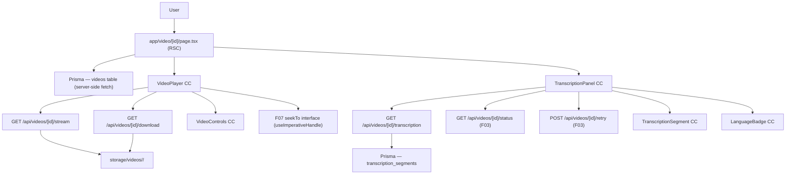

# Spec: F06 — Video Player with Transcription Panel

## 1. Technical Overview

F06 implements the video detail page at `/video/:id`, delivering an HTML5 custom video player paired with a synchronized transcription panel. The page is a React Server Component that fetches video metadata and segments server-side; the player and transcription components are Client Components that handle DOM interaction. No external player library is used — all controls (play/pause, seek bar, volume slider, speed selector, fullscreen, download) are implemented as custom React elements over the native HTML5 `<video>` element, consistent with the project's local-first, zero-external-dependency ethos.

Video files are served by a new `GET /api/videos/[id]/stream` route handler that verifies session ownership and streams the original file with HTTP range-request support, enabling the browser's built-in seek capability. A companion `GET /api/videos/[id]/download` route serves the file with `Content-Disposition: attachment` so the user's browser triggers a native download. Transcription segments are fetched from `GET /api/videos/[id]/transcription`, which returns rows from `transcription_segments` ordered by `start_ms ASC`.

Transcription synchronization runs on a 250 ms `setInterval` that reads `videoElement.currentTime`, identifies the active segment (the latest segment whose `startMs ≤ currentTimeMs ≤ endMs`), applies a blue-background highlight to it, and programmatically scrolls the panel to keep the active row in view. Clicking any segment invokes `videoElement.currentTime = segment.startMs / 1000` — the same logic exposed externally as a `seekTo(ms: number)` method via `useImperativeHandle`, so F07 can trigger seeks without re-implementing the seek logic.

When the video's status is `Queued` or `Processing`, the transcription panel shows a static "being processed" message and polls `GET /api/videos/[id]/status` (imported from F03) every 10 seconds to detect when status transitions to `Ready`, at which point the segments are loaded without a full page reload. When status is `Failed`, the panel shows a failure message and a Retry button that calls `POST /api/videos/[id]/retry`.

**Scope — Included:**
- `/video/[id]` page (RSC) — full-width layout with responsive two-column split (player left, transcription right on desktop; stacked on mobile)
- Custom HTML5 video player Client Component with all six controls
- `GET /api/videos/[id]/stream` — ownership-checked streaming with HTTP range support
- `GET /api/videos/[id]/download` — ownership-checked download with `Content-Disposition: attachment`
- `GET /api/videos/[id]/transcription` — segments ordered by `start_ms ASC`
- `GET /api/videos/[id]/meta` — video metadata for the page RSC (title, status, language, duration, segment count)
- Transcription panel with 250 ms active-segment sync, auto-scroll, and segment click-to-seek
- Language badge showing `PT`, `EN`, or `ES` in the panel header
- Status-aware panel states: loading, processing, failed (with Retry button)
- Polling `GET /api/videos/[id]/status` every 10 s when status is not `Ready`
- `seekTo(ms: number)` interface exposed via `useImperativeHandle` for F07 integration
- Redirect to `/library` if video not found or not owned by the authenticated user

**Scope — Deferred:**
- Transcription in-panel search input and match highlighting (F07)
- Global navigation search bar (F08)
- Category/tag/description management sidebar (F05)
- Video quality selection (not in PRD scope)
- Subtitle/caption rendering (not in PRD scope)

---

## 2. Architecture Impact

**New Files:**

| File Path | New/Modified | Purpose | Key Responsibilities |
|-----------|--------------|---------|---------------------|
| `app/video/[id]/page.tsx` | New | Video detail page RSC | Fetch video metadata via Prisma; verify ownership; redirect to `/library` on 404 or wrong user; render `VideoPlayer` and `TranscriptionPanel` with initial data |
| `app/components/video/video-player.tsx` | New | Custom HTML5 player CC | HTML5 `<video>` with custom controls: play/pause, seek bar, elapsed/total, volume, speed dropdown, fullscreen button, download button; exposes `seekTo(ms)` via `useImperativeHandle` |
| `app/components/video/video-controls.tsx` | New | Player controls bar CC | Renders and handles all interactive controls separately from the `<video>` element; receives state and callbacks from VideoPlayer |
| `app/components/video/transcription-panel.tsx` | New | Transcription panel CC | Renders segment list; manages active-segment state from 250 ms timer; handles click-to-seek; shows status-based empty states; polls status when not Ready |
| `app/components/video/transcription-segment.tsx` | New | Single segment row CC | Displays HH:MM:SS timestamp + text; applies blue-highlight when active; forwards click to parent `onSeek` |
| `app/components/video/language-badge.tsx` | New | Language badge CC | Renders PT / EN / ES pill in panel header; handles `null` language gracefully |
| `app/api/videos/[id]/stream/route.ts` | New | Video streaming endpoint | Auth session check; ownership verify; read file from `storage/videos/`; handle `Range` header; return `206 Partial Content` or `200` with correct MIME type |
| `app/api/videos/[id]/download/route.ts` | New | Video download endpoint | Auth session check; ownership verify; return file with `Content-Disposition: attachment; filename="<originalName>"` |
| `app/api/videos/[id]/transcription/route.ts` | New | Transcription segments endpoint | Auth session check; ownership verify; return `TranscriptionSegment[]` ordered by `startMs ASC` |
| `app/api/videos/[id]/meta/route.ts` | New | Video metadata endpoint | Auth session check; ownership verify; return lightweight metadata used by the page (title, status, language, durationSeconds, segment count) |
| `app/lib/validations/video.ts` | New/Modified | Zod schemas for video routes | Schema for video ID param validation; reused across stream/download/transcription/meta routes |



---

## 3. Technical Decisions

| Decision | Chosen Approach | Alternative Considered | Trade-off |
|----------|----------------|----------------------|-----------|
| Video delivery | Ownership-checked HTTP streaming via `GET /api/videos/[id]/stream` with Range header support | Signed URLs with 1-hour expiry (PRD language) | No cloud storage in this project; range requests enable native browser seeking; auth is per-request via session cookie instead of an expiring token — simpler and sufficient for a local platform |
| Player implementation | Native HTML5 `<video>` + custom React controls | Third-party library (Video.js, Plyr, ReactPlayer) | Zero additional dependencies; full control over layout and styling; native `<video>` exposes all required events (`timeupdate`, `ended`, `seeking`, `volumechange`, `fullscreenchange`); Fullscreen API calls `element.requestFullscreen()` directly |
| Transcription sync interval | `setInterval` at 250 ms, reading `videoElement.currentTime` | `requestAnimationFrame` (60 fps) or `timeupdate` event | 250 ms matches PRD requirement; `timeupdate` fires too infrequently during scrubbing; `requestAnimationFrame` is unnecessarily frequent for this use case |
| `seekTo` interface for F07 | `useImperativeHandle` on a `forwardRef`-wrapped VideoPlayer | Callback prop / context / Zustand store | Minimal coupling — F07 holds a ref to VideoPlayer and calls `seekTo(ms)` directly; no global state needed; clean React pattern for imperative DOM-like commands |
| Download delivery | `GET /api/videos/[id]/download` with `Content-Disposition: attachment` | Direct `<a href>` to streaming URL | A dedicated download route ensures ownership check is applied; prevents direct URL sharing of files; filename in the header matches the user's original filename |
| Status polling when not Ready | `setInterval` at 10 s calling `GET /api/videos/[id]/status` (F03 endpoint) | WebSocket / SSE | Matches the existing F03/F04 polling frequency; no new infrastructure; polling stops immediately when status transitions to `Ready` and segments are fetched |

---

## 4. Component Overview

**Frontend:**

| File Path | New/Modified | Purpose | Key Responsibilities |
|-----------|--------------|---------|---------------------|
| `app/video/[id]/page.tsx` | New | Video detail page RSC | Prisma `findFirst` by `id + userId`; redirect to `/library` if null; pass `video` and `segments` as props to Client Components; render two-column responsive layout |
| `app/components/video/video-player.tsx` | New | Custom HTML5 player CC | `forwardRef` + `useImperativeHandle` exposing `{ seekTo(ms) }`; manage `isPlaying`, `currentTime`, `duration`, `volume`, `playbackRate`, `isFullscreen` state; attach `<video>` event listeners; provide imperative interface for F07 |
| `app/components/video/video-controls.tsx` | New | Player controls bar CC | Render play/pause button, seek bar (`<input type="range">`), elapsed/total time labels, volume slider, speed dropdown (0.5/0.75/1/1.25/1.5/2), fullscreen button, download anchor; receive all values and callbacks from VideoPlayer |
| `app/components/video/transcription-panel.tsx` | New | Transcription panel CC | Accept `segments`, `videoStatus`, `language`, `videoRef` props; run 250 ms sync interval; manage `activeSegmentId` state; handle `onSeek` by calling `videoRef.current.seekTo(ms)`; render panel header, segment list, or status-based empty states; poll status API when not Ready |
| `app/components/video/transcription-segment.tsx` | New | Single segment row CC | Accept `segment`, `isActive`, `onClick` props; format `startMs` to `HH:MM:SS`; apply blue-highlight class when `isActive`; forward click to `onClick(segment.startMs)` |
| `app/components/video/language-badge.tsx` | New | Language badge CC | Accept `language: string \| null`; render uppercased pill (`PT`, `EN`, `ES`); render nothing when `null` |

**Backend:**

| File Path | New/Modified | Purpose | Key Responsibilities |
|-----------|--------------|---------|---------------------|
| `app/api/videos/[id]/stream/route.ts` | New | Video streaming | `auth()` guard; `await params`; Prisma `findFirst` by `id + userId`; read `Range` header; open file with `fs.createReadStream`; respond with `Content-Type: <mimeType>`, `Accept-Ranges: bytes`, `206` partial or `200` full response |
| `app/api/videos/[id]/download/route.ts` | New | Video download | `auth()` guard; `await params`; ownership check; respond with `Content-Disposition: attachment; filename="<originalName>"`; stream full file body |
| `app/api/videos/[id]/transcription/route.ts` | New | Segments endpoint | `auth()` guard; `await params`; ownership check via `videos`; `prisma.transcriptionSegment.findMany({ where: { videoId: id }, orderBy: { startMs: 'asc' } })`; return JSON array |
| `app/api/videos/[id]/meta/route.ts` | New | Metadata endpoint | `auth()` guard; `await params`; ownership check; return `id, title, status, language, durationSeconds, uploadedAt, _count.transcriptionSegments`; used by RSC for lightweight polling in some client scenarios |
| `app/lib/validations/video.ts` | New | Zod schemas | `videoIdSchema` — UUID string; reused in all `/api/videos/[id]/*` routes for consistent validation |

**No Database Migration Required** — F06 reads from existing `videos` and `transcription_segments` tables created by F03. No schema changes needed.

---

## 5. API Contracts

### GET /api/videos/[id]/meta

- **Method:** GET
- **Path:** `/api/videos/[id]/meta`
- **Authentication:** Auth.js session cookie (required)
- **URL param:** `id` — video UUID (resolved via `await params` — Next.js 16)

**Response (200):**

| Field | Type | Description |
|-------|------|-------------|
| `id` | `string` | Video UUID |
| `title` | `string` | Video title |
| `status` | `"Queued" \| "Processing" \| "Ready" \| "Failed"` | Current processing status |
| `language` | `string \| null` | ISO 639-1 code: `"pt"`, `"en"`, or `"es"`; `null` until Ready |
| `durationSeconds` | `number \| null` | Duration in seconds; `null` until FFmpeg completes |
| `uploadedAt` | `string` | ISO 8601 timestamp |
| `segmentCount` | `number` | Total number of transcription segments |

**Response Example:**
```json
{
  "id": "550e8400-e29b-41d4-a716-446655440000",
  "title": "Project Kickoff Meeting",
  "status": "Ready",
  "language": "pt",
  "durationSeconds": 342.5,
  "uploadedAt": "2026-06-21T14:30:00.000Z",
  "segmentCount": 48
}
```

**Error Codes:**

| Code | HTTP Status | Description |
|------|-------------|-------------|
| — | 401 | No valid session |
| PLAY001 | 404 | Video not found or does not belong to the authenticated user |

---

### GET /api/videos/[id]/transcription

- **Method:** GET
- **Path:** `/api/videos/[id]/transcription`
- **Authentication:** Auth.js session cookie (required)
- **URL param:** `id` — video UUID

**Response (200):**

| Field | Type | Description |
|-------|------|-------------|
| `segments` | `array` | Ordered list of transcription segments (`startMs ASC`) |
| `segments[].id` | `string` | Segment UUID |
| `segments[].startMs` | `number` | Segment start position in milliseconds |
| `segments[].endMs` | `number` | Segment end position in milliseconds |
| `segments[].text` | `string` | Transcribed text for the segment |

**Response Example:**
```json
{
  "segments": [
    {
      "id": "a1b2c3d4-e5f6-7890-abcd-ef1234567890",
      "startMs": 0,
      "endMs": 4500,
      "text": "Bom dia a todos, vamos começar a reunião."
    },
    {
      "id": "b2c3d4e5-f6a7-8901-bcde-f12345678901",
      "startMs": 4500,
      "endMs": 9200,
      "text": "Hoje vamos discutir o planejamento do próximo trimestre."
    }
  ]
}
```

**Response when no segments exist (status not Ready):**
```json
{
  "segments": []
}
```

**Error Codes:**

| Code | HTTP Status | Description |
|------|-------------|-------------|
| — | 401 | No valid session |
| PLAY001 | 404 | Video not found or does not belong to the authenticated user |

---

### GET /api/videos/[id]/stream

- **Method:** GET
- **Path:** `/api/videos/[id]/stream`
- **Authentication:** Auth.js session cookie (required)
- **URL param:** `id` — video UUID
- **Request header (optional):** `Range: bytes=<start>-<end>`

**Response (206 Partial Content — with Range header):**

| Header | Value | Description |
|--------|-------|-------------|
| `Content-Type` | `<video.mimeType>` | Original MIME type (e.g., `video/mp4`) |
| `Content-Range` | `bytes <start>-<end>/<total>` | Byte range served |
| `Content-Length` | `<chunk size>` | Size of the served chunk |
| `Accept-Ranges` | `bytes` | Advertises byte-range support |

**Response (200 — without Range header):**

| Header | Value | Description |
|--------|-------|-------------|
| `Content-Type` | `<video.mimeType>` | Original MIME type |
| `Content-Length` | `<file size>` | Total file size |
| `Accept-Ranges` | `bytes` | Advertises byte-range support |

**Error Codes:**

| Code | HTTP Status | Description |
|------|-------------|-------------|
| — | 401 | No valid session |
| PLAY001 | 404 | Video not found or does not belong to the authenticated user |
| PLAY002 | 416 | Range not satisfiable — requested range exceeds file size |

---

### GET /api/videos/[id]/download

- **Method:** GET
- **Path:** `/api/videos/[id]/download`
- **Authentication:** Auth.js session cookie (required)
- **URL param:** `id` — video UUID

**Response (200):**

| Header | Value | Description |
|--------|-------|-------------|
| `Content-Type` | `<video.mimeType>` | Original MIME type |
| `Content-Disposition` | `attachment; filename="<video.originalName>"` | Forces browser download |
| `Content-Length` | `<file size as number>` | Total file size (`fileSizeBytes` serialized as `Number`) |

**Error Codes:**

| Code | HTTP Status | Description |
|------|-------------|-------------|
| — | 401 | No valid session |
| PLAY001 | 404 | Video not found or does not belong to the authenticated user |

---

## 6. Data Model

No new tables or columns. F06 reads from `videos` and `transcription_segments` created by F02 and F03.

### Queries Used

**Page RSC — initial data fetch:**
```sql
SELECT v.id, v.title, v.status, v.language, v.duration_seconds, v.mime_type,
       v.file_path, v.original_name, v.file_size_bytes, v.uploaded_at,
       COUNT(ts.id) AS segment_count
FROM videos v
LEFT JOIN transcription_segments ts ON ts.video_id = v.id
WHERE v.id = $1 AND v.user_id = $2
GROUP BY v.id;
```

**Transcription endpoint — segments ordered by position:**
```sql
SELECT id, video_id, start_ms, end_ms, text, created_at
FROM transcription_segments
WHERE video_id = $1
ORDER BY start_ms ASC;
```

The existing index `ix_ts_video_id` on `transcription_segments(video_id)` (created by F03) makes the transcription query efficient.

**Note on `fileSizeBytes` (BigInt):** When serializing the `Content-Length` header in the download route, convert with `Number(video.fileSizeBytes)`. Do not pass `BigInt` directly to a header value.

---

## 7. Testing Strategy

**Test File Structure:**

| Test File | Test Type | Target | Coverage Goal |
|-----------|-----------|--------|---------------|
| `app/api/videos/[id]/transcription/__tests__/route.test.ts` | Integration (real DB) | `GET /api/videos/:id/transcription` | Segments returned ordered; empty array when none; 404 wrong user; 401 unauthenticated |
| `app/api/videos/[id]/stream/__tests__/route.test.ts` | Integration (real DB + filesystem) | `GET /api/videos/:id/stream` | Full file response; Range header response (206); 416 invalid range; 404 wrong user; 401 unauthenticated |
| `app/api/videos/[id]/download/__tests__/route.test.ts` | Integration (real DB + filesystem) | `GET /api/videos/:id/download` | `Content-Disposition: attachment` header present; filename matches `originalName`; 404 wrong user; 401 unauthenticated |
| `app/api/videos/[id]/meta/__tests__/route.test.ts` | Integration (real DB) | `GET /api/videos/:id/meta` | All fields returned; segmentCount accurate; 404 wrong user; 401 unauthenticated |
| `app/components/video/__tests__/transcription-panel.test.tsx` | Unit (jsdom) | `TranscriptionPanel` | Active segment highlighted at correct `currentTime`; click-to-seek calls `onSeek` with correct ms; processing state message; failed state shows Retry button |
| `app/components/video/__tests__/video-player.test.tsx` | Unit (jsdom) | `VideoPlayer` + `seekTo` | `seekTo(ms)` sets `video.currentTime` correctly; speed selection changes `playbackRate`; fullscreen button calls `requestFullscreen` |
| `tests/e2e/video-player.spec.ts` | E2E (Playwright) | `/video/:id` page | All 6 speeds selectable; segment click seeks video; active segment highlighted and scrolled; download initiates; processing panel message shown for Queued/Processing video; Retry button shown for Failed video |

---

**`app/api/videos/[id]/transcription/__tests__/route.test.ts`:**

| Test Function | Description | Assertions |
|---------------|-------------|------------|
| `test_transcription_returns_segments_ordered_by_start_ms` | Video with 3 segments inserted in random order | Returns 200; `segments` array ordered by `startMs ASC`; all 3 segments present with correct fields |
| `test_transcription_returns_empty_array_when_no_segments` | Video exists in Queued status with no segments | Returns 200; `segments` is `[]` |
| `test_transcription_wrong_user` | Video belongs to a different user | Returns 404 with code `PLAY001` |
| `test_transcription_video_not_found` | UUID does not exist | Returns 404 with code `PLAY001` |
| `test_transcription_unauthenticated` | No session cookie | Returns 401 |

---

**`app/api/videos/[id]/stream/__tests__/route.test.ts`:**

| Test Function | Description | Assertions |
|---------------|-------------|------------|
| `test_stream_full_file_no_range_header` | Valid video, no `Range` header | Returns 200; `Content-Type` matches `mimeType`; `Accept-Ranges: bytes` header present; body equals file content |
| `test_stream_partial_content_with_range` | Valid video, `Range: bytes=0-1023` | Returns 206; `Content-Range: bytes 0-1023/<size>`; `Content-Length: 1024` |
| `test_stream_invalid_range` | `Range: bytes=9999999-9999999` where file is smaller | Returns 416 |
| `test_stream_wrong_user` | Video belongs to different user | Returns 404 with code `PLAY001` |
| `test_stream_unauthenticated` | No session cookie | Returns 401 |

---

**`app/api/videos/[id]/download/__tests__/route.test.ts`:**

| Test Function | Description | Assertions |
|---------------|-------------|------------|
| `test_download_returns_attachment_header` | Valid video owned by user | Returns 200; `Content-Disposition` is `attachment; filename="<originalName>"` |
| `test_download_content_length_is_number` | `fileSizeBytes` is BigInt in DB | `Content-Length` header is a valid number string (not `[object BigInt]`) |
| `test_download_wrong_user` | Video belongs to different user | Returns 404 with code `PLAY001` |
| `test_download_unauthenticated` | No session cookie | Returns 401 |

---

**`app/api/videos/[id]/meta/__tests__/route.test.ts`:**

| Test Function | Description | Assertions |
|---------------|-------------|------------|
| `test_meta_ready_video_with_segments` | Ready video with 5 segments | Returns 200; `segmentCount: 5`; `language` non-null; `durationSeconds` non-null |
| `test_meta_queued_video` | Video in Queued status, no segments | Returns 200; `segmentCount: 0`; `language: null`; `durationSeconds: null` |
| `test_meta_wrong_user` | Video belongs to different user | Returns 404 with code `PLAY001` |
| `test_meta_unauthenticated` | No session cookie | Returns 401 |

---

**`app/components/video/__tests__/transcription-panel.test.tsx`:**

| Test Function | Description | Assertions |
|---------------|-------------|------------|
| `test_panel_highlights_active_segment` | `currentTimeMs = 5000` with segment `startMs=4500, endMs=6000` | That segment row has the blue-highlight CSS class; others do not |
| `test_panel_no_active_segment_between_gaps` | `currentTimeMs = 3000` with segment `startMs=3500` | No segment is highlighted |
| `test_panel_segment_click_calls_onSeek` | User clicks segment with `startMs=12000` | `onSeek` callback called with `12000` |
| `test_panel_shows_processing_message_when_queued` | `videoStatus = "Queued"` | Renders "Transcription is being processed. It will appear here when ready." |
| `test_panel_shows_processing_message_when_processing` | `videoStatus = "Processing"` | Same processing message rendered |
| `test_panel_shows_failed_state_with_retry_button` | `videoStatus = "Failed"` | Renders failure message and `<button>` labeled "Retry" |
| `test_panel_retry_button_calls_retry_api` | User clicks Retry button | `POST /api/videos/:id/retry` is called |

---

**`app/components/video/__tests__/video-player.test.tsx`:**

| Test Function | Description | Assertions |
|---------------|-------------|------------|
| `test_seekTo_sets_current_time` | Call `ref.current.seekTo(5000)` | `videoElement.currentTime` equals `5` |
| `test_speed_selection_changes_playback_rate` | Select `1.5` from speed dropdown | `videoElement.playbackRate` equals `1.5` |
| `test_all_six_speeds_are_available` | Render VideoPlayer; inspect speed dropdown options | Options include exactly 0.5, 0.75, 1, 1.25, 1.5, 2 |
| `test_fullscreen_button_requests_fullscreen` | Click fullscreen button | `element.requestFullscreen` was called once |

---

**`tests/e2e/video-player.spec.ts`:**

| Test Function | Description | Assertions |
|---------------|-------------|------------|
| `test_e2e_video_player_loads_within_3_seconds` | Navigate to `/video/:id`; measure time to `canplay` event | Page renders player within 3 seconds |
| `test_e2e_all_speeds_take_effect` | Select each of 6 speeds via dropdown | `video.playbackRate` matches the selected value after each selection |
| `test_e2e_segment_click_seeks_video` | Click second segment in panel | `video.currentTime` is within 0.5 s of `segment.startMs / 1000` within 500 ms |
| `test_e2e_active_segment_highlighted_during_playback` | Play video for 2 seconds | Active segment has blue-background style; panel has scrolled to it |
| `test_e2e_download_button_triggers_download` | Click download button | Browser download is initiated (`download` attribute on anchor or `Content-Disposition` header) |
| `test_e2e_processing_panel_shown_for_queued_video` | Navigate to video with status Queued | Panel shows "Transcription is being processed. It will appear here when ready." |
| `test_e2e_retry_button_shown_for_failed_video` | Navigate to video with status Failed | Panel shows failure message and Retry button |
| `test_e2e_language_badge_matches_detected_language` | Video with `language = "pt"` | Panel header shows "PT" badge |
